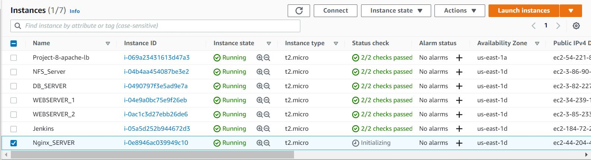
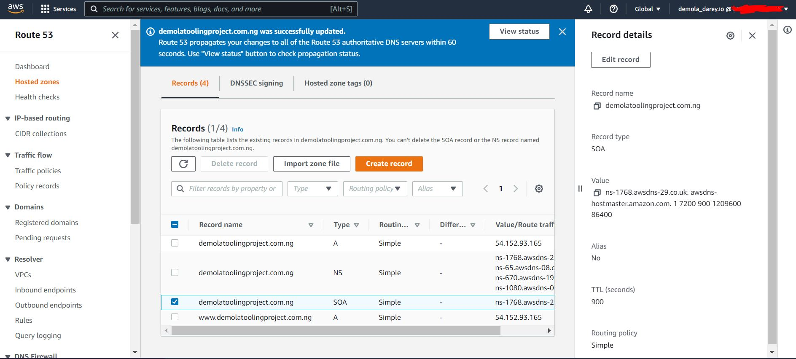

# Project 10: LOAD BALANCER SOLUTION WITH NGINX AND SSL/TLS

## Task

This project consists of two parts:

1. Configure Nginx as a Load Balancer
2. Register a new domain name and configure secured connection using SSL/TLS certificates

Your target architecture will look like this:

**_Project 10 Architecture Diagram_**

---

## CONFIGURE NGINX AS A LOAD BALANCER

1. Create an EC2 VM based on Ubuntu Server 20.04 LTS and name it Nginx LB (do not forget to open TCP port 80 for HTTP connections, also open `TCP port 443` – this port is used for secured HTTPS connections)

2. Update `/etc/hosts` file for local `DNS` with Web Servers’ names (e.g. `Web1 and Web2`) and their local IP addresses

3.  Install and configure `Nginx` as a load balancer to point traffic to the resolvable `DNS` names of the webservers

    Update the instance and Install Nginx

         sudo apt update
         sudo apt install nginx

    Configure Nginx LB using Web Servers’ names defined in `/etc/hosts`

    Hint: Read this [blog](https://linuxize.com/post/how-to-edit-your-hosts-file/) to read about `/etc/host`

    Open the default nginx configuration file

    `sudo vi /etc/nginx/nginx.conf`

        #insert following configuration into http section

        upstream myproject {
            server Web1 weight=5;
            server Web2 weight=5;
          }

        server {
            listen 80;
            server_name www.domain.com;
            location / {
              proxy_pass http://myproject;
            }
          }

        #comment out this line
        #include /etc/nginx/sites-enabled/*;

    Restart Nginx and make sure the service is up and running

        sudo systemctl restart nginx
        sudo systemctl status nginx

## REGISTER A NEW DOMAIN NAME AND CONFIGURE SECURED CONNECTION USING SSL/TLS CERTIFICATES

Make necessary configurations to make connections to our Tooling Web Solution secured!

In order to get a valid SSL certificate – you need to register a new domain name, you can do it using any Domain name registrar – a company that manages reservation of domain names.

The most popular ones are: [Godaddy.com](https://www.godaddy.com/en-uk), [Domain.com](https://www.domain.com/), [Bluehost.com](https://www.bluehost.com/), [Whogohost.com](https://www.whogohost.com/).

1.  Register a new domain name with any registrar of your choice in any domain zone (e.g. .com, .net, .org, .edu, .info, .xyz or any other)

    

    

2.  Assign an Elastic IP to your Nginx LB server and associate your domain name with this Elastic IP

    You might have noticed, that every time you restart or stop/start your EC2 instance – you get a new public IP address. When you want to associate your domain name – it is better to have a static IP address that does not change after reboot. Elastic IP is the solution for this problem, learn how to allocate an Elastic IP and associate it with an EC2 server [on this page](https://docs.aws.amazon.com/AWSEC2/latest/UserGuide/elastic-ip-addresses-eip.html).

3.  Update [A record](https://www.cloudflare.com/learning/dns/dns-records/dns-a-record/) in your registrar to point to Nginx LB using Elastic IP address

    

    

    

    

    Learn how associate your domain name to your Elastic IP [on this page](https://medium.com/progress-on-ios-development/connecting-an-ec2-instance-with-a-godaddy-domain-e74ff190c233).

    Check that your Web Servers can be reached from your browser using new domain name using `HTTP` protocol – `http://<your-domain-name.com>`

    

4.  Configure Nginx to recognize your new domain name

        Update your nginx.conf with server_name www.<your-domain-name.com> instead of server_name www.domain.com

    

5.  Install [certbot](https://certbot.eff.org/) and request for an SSL/TLS certificate

    Make sure [snapd](https://snapcraft.io/snapd) service is active and running

    `sudo systemctl status snapd`

    

    Install certbot

    `sudo snap install --classic certbot`

    

    Request your certificate (just follow the certbot instructions – you will need to choose which domain you want your certificate to be issued for, domain name will be looked up from nginx.conf file so make sure you have updated it on step 4).

          sudo ln -s /snap/bin/certbot /usr/bin/certbot
          sudo certbot --nginx

    

    Test secured access to your Web Solution by trying to reach `https://<your-domain-name.com>`

    You shall be able to access your website by using HTTPS protocol (that uses TCP port 443) and see a padlock pictogram in your browser’s search string.

    Click on the padlock icon and you can see the details of the certificate issued for your website.

    

    

6.  Set up periodical renewal of your SSL/TLS certificate
    By default, LetsEncrypt certificate is valid for 90 days, so it is recommended to renew it at least every 60 days or more frequently.

    You can test renewal command in `dry-run` mode

    `sudo certbot renew --dry-run`

    

    Best pracice is to have a scheduled job that to run renew command periodically. Let us configure a cronjob to run the command twice a day.

    To do so, lets edit the crontab file with the following command:

    `crontab -e`

    Add following line:

        * */12 * * *   root /usr/bin/certbot renew > /dev/null 2>&1

    

    You can always change the interval of this cronjob if twice a day is too often by adjusting schedule expression.

    To refresh your cron configuration knowledge by watching this [video](https://www.youtube.com/watch?v=4g1i0ylvx3A).

    You can also use this handy [online cron expression editor](https://crontab.guru/).
