# Project 11: ANSIBLE CONFIGURATION MANAGEMENT – AUTOMATE PROJECT 7 TO 10

### Task

1. Install and configure Ansible client to act as a Jump Server/Bastion Host
2. Create a simple Ansible playbook to automate servers configuration

### STEP 1 - INSTALL AND CONFIGURE ANSIBLE ON EC2 INSTANCE

1.  Update `Name` tag on your `Jenkins` EC2 Instance to `Jenkins-Ansible`. We will use this server to run playbooks.

    

2.  In your GitHub account create a new repository and name it `ansible-config-mgt`.

    

3.  Install Ansible

        sudo apt update
        sudo apt install ansible

    Check your Ansible version by running `ansible --version`

    

4.  Configure Jenkins build job to save your repository content every time you change it – this will solidify your Jenkins configuration skills acquired in [Project 9](https://github.com/demola07/darey.io_projects/blob/main/project9.md).

    1. Create a new Freestyle project ansible in Jenkins and point it to your `‘ansible-config-mgt’` repository.
    2. Configure Webhook in GitHub and set webhook to trigger ansible build.
    3. Configure a Post-build job to save all (\*\*) files, like you did it in [Project 9](https://github.com/demola07/darey.io_projects/blob/main/project9.md).

    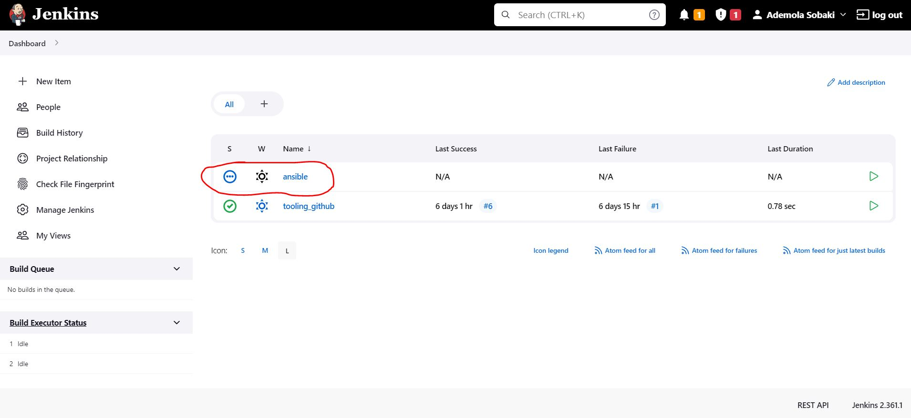

    

    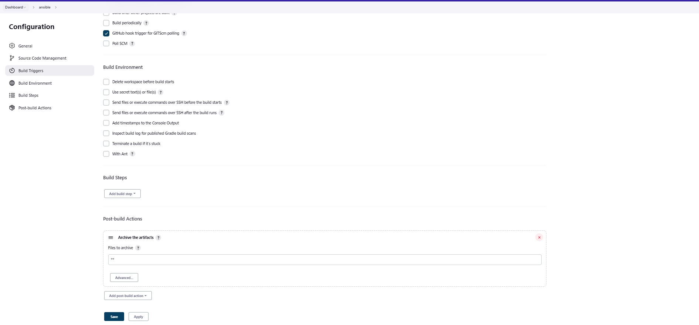

    

    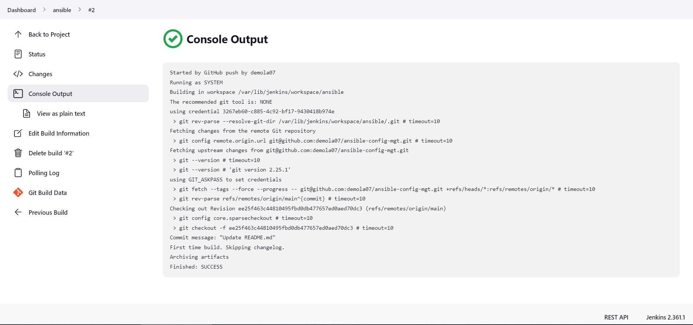

5.  Test your setup by making some change in README.MD file in master branch and make sure that builds starts automatically and Jenkins saves the files (build artifacts) in following folder

    `ls /var/lib/jenkins/jobs/ansible/builds/<build_number>/archive/`

    Note: Trigger Jenkins project execution only for `/main (master)` branch.

    Now our setup will look like this:

    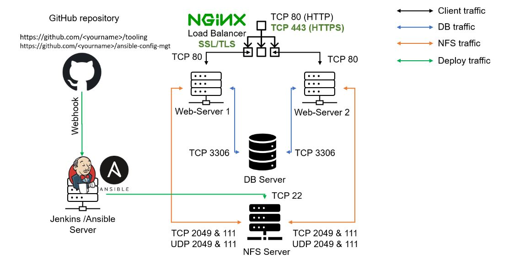

    **_Tip: Every time you stop/start your Jenkins-Ansible server – you have to reconfigure GitHub webhook to a new IP address, in order to avoid it, it makes sense to allocate an Elastic IP to your Jenkins-Ansible server (you have done it before to your LB server in Project 10). Note that Elastic IP is free only when it is being allocated to an EC2 Instance, so do not forget to release Elastic IP once you terminate your EC2 Instance._**

### Step 2 – Prepare your development environment using Visual Studio Code

1.  First part of ‘DevOps’ is ‘Dev’, which means you will require to write some codes and you shall have proper tools that will make your coding and debugging comfortable – you need an Integrated development environment (IDE) or Source-code Editor. There is a plethora of different IDEs and Source-code Editors for different languages with their own advantages and drawbacks, you can choose whichever you are comfortable with, but we recommend one free and universal editor that will fully satisfy your needs – Visual Studio Code (VSC), you can get it [here](https://code.visualstudio.com/download).

2.  After you have successfully installed VSC, configure it to connect to your newly created GitHub repository.

3.  Clone down your `ansible-config-mgt` repo to your Jenkins-Ansible instance

        git clone <ansible-config-mgt repo link>

### Step 3 - BEGIN ANSIBLE DEVELOPMENT

1. In your ansible-config-mgt GitHub repository, create a new branch that will be used for development of a new feature.

   **_Tip: Give your branches descriptive and comprehensive names, for example, if you use [Jira](https://www.atlassian.com/software/jira) or [Trello](https://trello.com/) as a project management tool – include ticket number (e.g. PRJ-145) in the name of your branch and add a topic and a brief description what this branch is about – a bugfix, hotfix, feature, release (e.g. feature/prj-145-lvm)_**

2. Checkout the newly created feature branch to your local machine and start building your code and directory structure

   

3. Create a directory and name it `playbooks` – it will be used to store all your playbook files.

4. Create a directory and name it `inventory` – it will be used to keep your hosts organised.

5. Within the playbooks folder, create your first playbook, and name it `common.yml`
6. Within the inventory folder, create an inventory file (.yml) for each environment (Development, Staging Testing and Production) `dev`, `staging`, `uat`, and `prod` respectively.

   

### Step 4 – Set up an Ansible Inventory

An Ansible inventory file defines the hosts and groups of hosts upon which commands, modules, and tasks in a playbook operate. Since our intention is to execute Linux commands on remote hosts, and ensure that it is the intended configuration on a particular server that occurs. It is important to have a way to organize our hosts in such an Inventory.

**_Note: Ansible uses `TCP` port 22 by default, which means it needs to ssh into target servers from `Jenkins-Ansible` host – for this you can implement the concept of [ssh-agent](https://smallstep.com/blog/ssh-agent-explained/#:~:text=ssh%2Dagent%20is%20a%20key,you%20connect%20to%20a%20server.&text=It%20doesn't%20allow%20your%20private%20keys%20to%20be%20exported.). Now you need to import your key into `ssh-agent`:_**

To learn how to setup SSH agent and connect VS Code to your Jenkins-Ansible instance, please see this video:

For Windows users – [ssh-agent on windows](https://www.youtube.com/watch?v=OplGrY74qog)

For Linux users – [ssh-agent on linux](https://www.youtube.com/watch?v=RRRQLgAfcJw)

    eval `ssh-agent -s`
    ssh-add <path-to-private-key>

Confirm the key has been added with the command below, you should see the name of your key

    ssh-add -l

Now, ssh into your `Jenkins-Ansible` server using ssh-agent

    ssh -A ubuntu@public-ip

Also notice, that your Load Balancer user is `ubuntu` and user for RHEL-based servers is `ec2-user`.

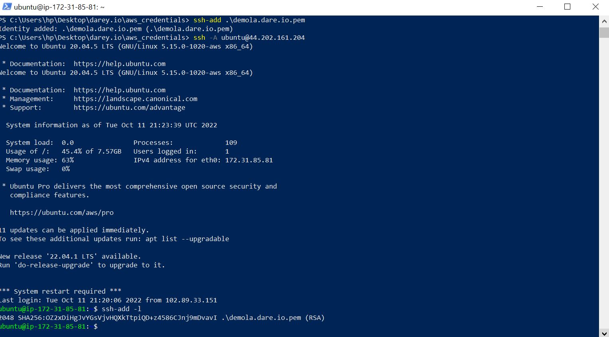

Update your `inventory/dev.yml` file with this snippet of code:

    [nfs]
    <NFS-Server-Private-IP-Address> ansible_ssh_user='ec2-user'

    [webservers]
    <Web-Server1-Private-IP-Address> ansible_ssh_user='ec2-user'
    <Web-Server2-Private-IP-Address> ansible_ssh_user='ec2-user'

    [db]
    <Database-Private-IP-Address> ansible_ssh_user='ec2-user'

    [lb]
    <Load-Balancer-Private-IP-Address> ansible_ssh_user='ubuntu'

### Step 5 – Create a Common Playbook

It is time to start giving Ansible the instructions on what you needs to be performed on all servers listed in `inventory/dev`.

In `common.yml` playbook you will write configuration for repeatable, re-usable, and multi-machine tasks that is common to systems within the infrastructure.

Update your `playbooks/common.yml` file with following code:

      ---
      - name: update web, nfs and db servers
        hosts: webservers, nfs, db
        remote_user: ec2-user
        become: yes
        become_user: root
        tasks:
          - name: ensure wireshark is at the latest version
            yum:
              name: wireshark
              state: latest

      - name: update LB server
        hosts: lb
        remote_user: ubuntu
        become: yes
        become_user: root
        tasks:
          - name: Update apt repo
            apt:
              update_cache: yes

          - name: ensure wireshark is at the latest version
            apt:
              name: wireshark
              state: latest

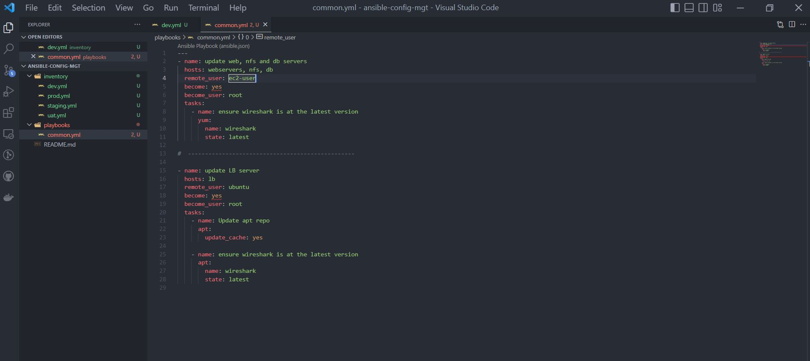

For a better understanding of Ansible playbooks – [watch this video from RedHat](https://www.youtube.com/watch?v=ZAdJ7CdN7DY) and read [this article](https://www.redhat.com/en/topics/automation/what-is-an-ansible-playbook).

### Step 6 – Update GIT with the latest code

Now all of your directories and files live on your machine and you need to push changes made locally to GitHub.

Now you have a separate branch, you will need to know how to raise a [Pull Request (PR)](https://docs.github.com/en/pull-requests/collaborating-with-pull-requests/proposing-changes-to-your-work-with-pull-requests/about-pull-requests), get your branch peer reviewed and merged to the `master`/ `main` branch.

Commit your code into GitHub:

1.  use git commands to add, commit and push your branch to GitHub.

        git status

        git add <selected files>

        git commit -m "commit message"

2.  Create a Pull request (PR)

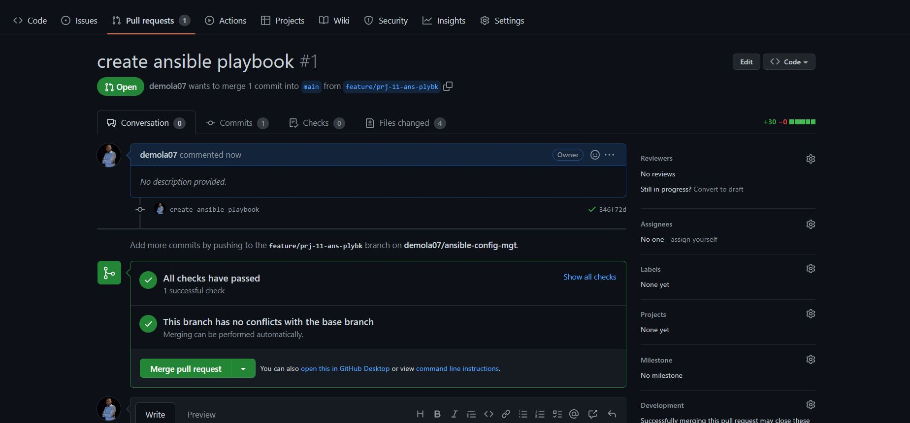

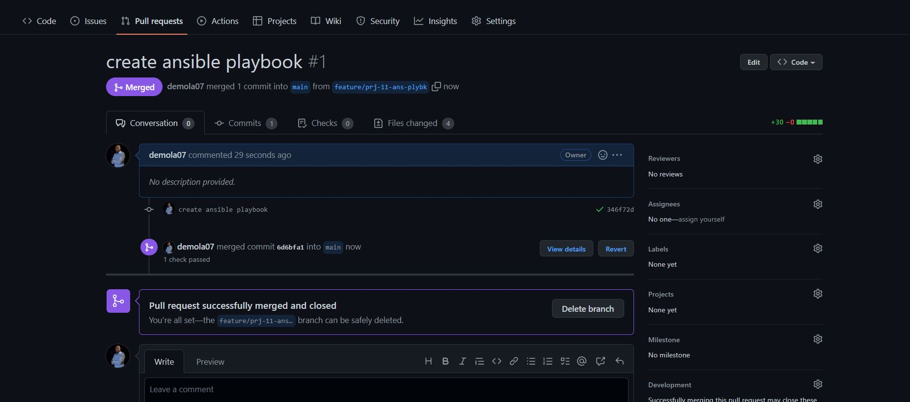

3.  Wear a hat of another developer for a second, and act as a reviewer.

4.  If the reviewer is happy with your new feature development, merge the code to the master branch.

5.  Head back on your terminal, checkout from the feature branch into the master, and pull down the latest changes.

Once your code changes appear in master branch – Jenkins will do its job and save all the files (build artifacts) to `/var/lib/jenkins/jobs/ansible/builds/<build_number>/archive`/ directory on `Jenkins-Ansible` server.

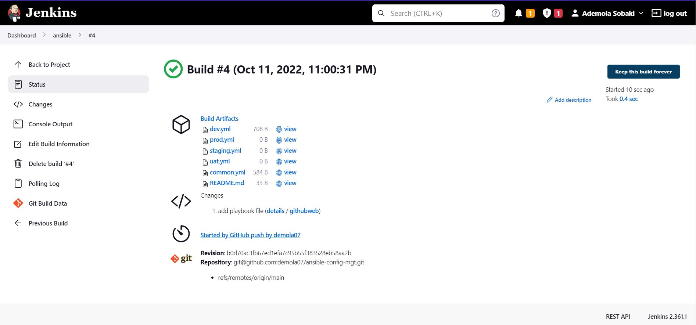

### Step 7 – Run first Ansible test

Now, it is time to execute `ansible-playbook` command and verify if your playbook actually works:

      cd ansible-config-mgt
      ansible-playbook -i inventory/dev.yml playbooks/common.yml

You can go to each of the servers and check if `wireshark` has been installed by running `which wireshark` or `wireshark --version`

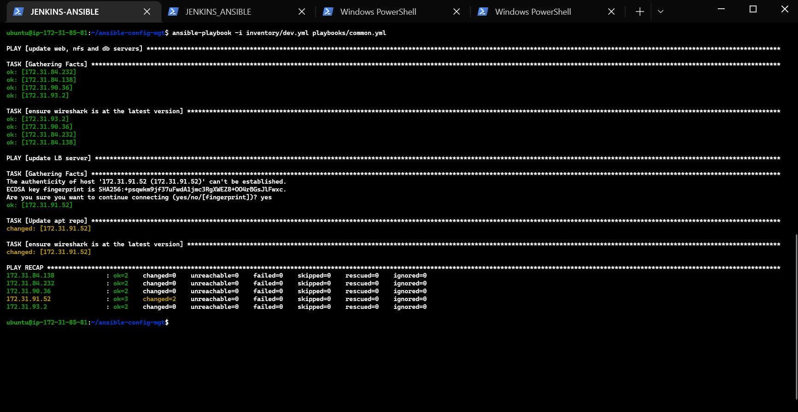

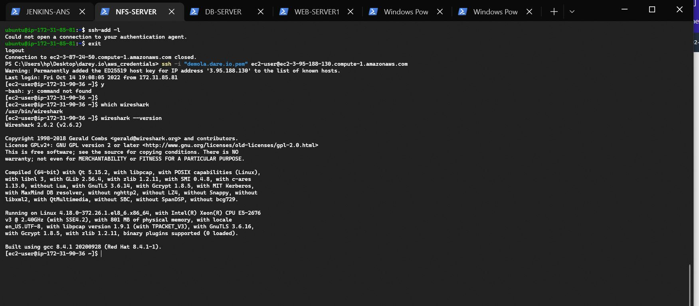

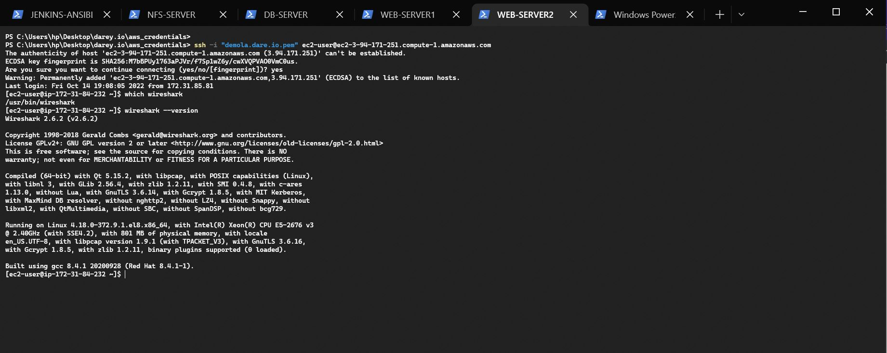

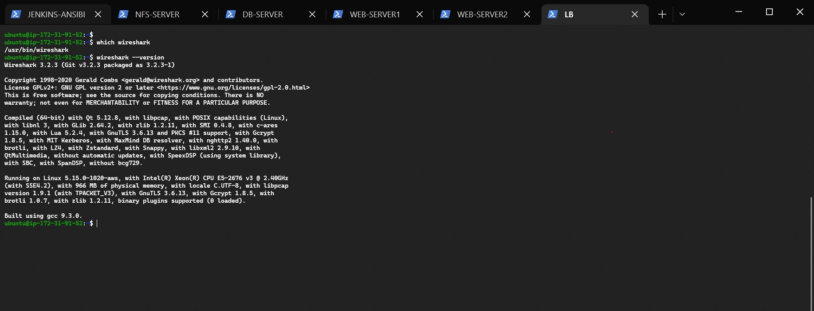
