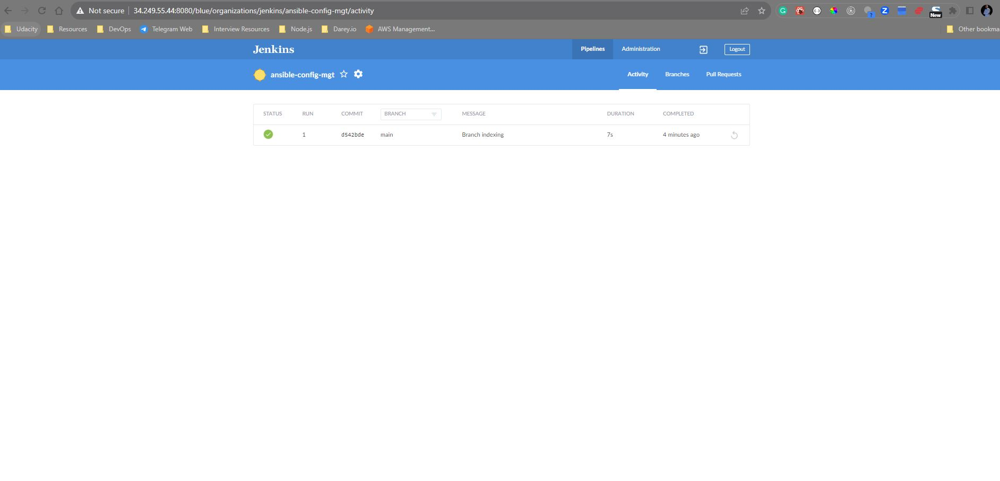
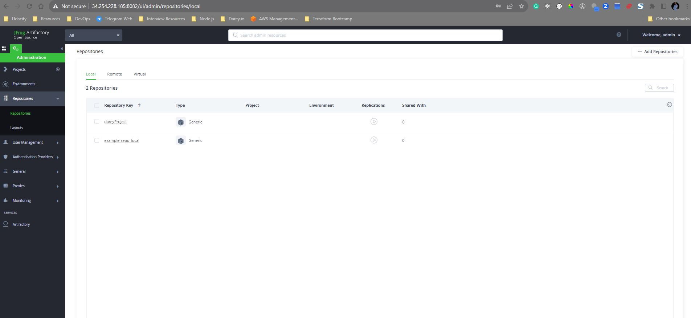
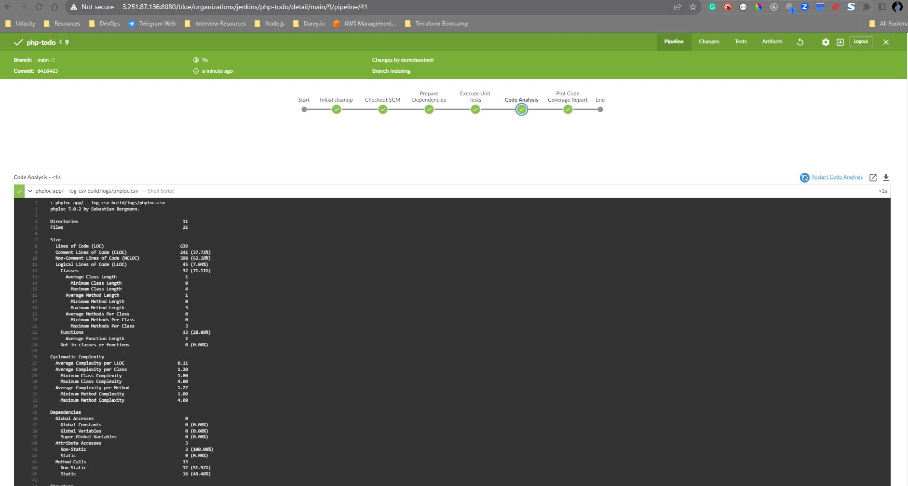

# Project 14 - CONTINUOUS INTEGRATION WITH JENKINS | ANSIBLE | ARTIFACTORY | SONARQUBE | PHP

## Project Description:


In this project, I will be setting up a CI/CD Pipeline for a PHP based application. The overall CI/CD process looks like the architecture above.

This project is architected in two major repositories with each repository containing its own CI/CD pipeline written in a Jenkinsfile.

- ansible-config-mgt REPO: this repository contains JenkinsFile which is responsible for setting up and configuring infrastructure required to carry out processes required for our application to run. It does this through the use of ansible roles. This repo is infrastructure specific

- PHP-todo REPO : this repository contains jenkinsfile which is focused on processes which are application build specific such as building, linting, static code analysis, push to artifact repository etc


## Prerequisites

Will be making use of AWS virtual machines for this and will require 6 servers for the project which includes: Nginx Server: This would act as the reverse proxy server to our site and tool.

**Jenkins server:** To be used to implement your CI/CD workflows or pipelines. Select a t2.medium at least, Ubuntu 20.04 and Security group should be open to port 8080

**SonarQube server:** To be used for Code quality analysis. Select a t2.medium at least, Ubuntu 20.04 and Security group should be open to port 9000

**Artifactory server:** To be used as the binary repository where the outcome of your build process is stored. Select a t2.medium at least and Security group should be open to port 8081

**Database server:** To server as the databse server for the Todo application

**Todo webserver:** To host the Todo web application.

## Environments

    ├── ci
    ├── dev
    ├── pentest
    ├── pre-prod
    ├── prod
    ├── sit
    └── uat


**ci inventory file**

    [jenkins]
    <Jenkins-Private-IP-Address>

    [nginx]
    <Nginx-Private-IP-Address>

    [sonarqube]
    <SonarQube-Private-IP-Address>

    [artifact_repository]
    <Artifact_repository-Private-IP-Address>

**dev Inventory file**

    [tooling]
    <Tooling-Web-Server-Private-IP-Address>

    [todo]
    <Todo-Web-Server-Private-IP-Address>

    [nginx]
    <Nginx-Private-IP-Address>

    [db:vars]
    ansible_user=ec2-user
    ansible_python_interpreter=/usr/bin/python

    [db]
    <DB-Server-Private-IP-Address>

    **pentest inventory file**

    [pentest:children]
    pentest-todo
    pentest-tooling

    [pentest-todo]
    <Pentest-for-Todo-Private-IP-Address>

    [pentest-tooling]
    <Pentest-for-Tooling-Private-IP-Address>

 ### ANSIBLE ROLES FOR CI ENVIRONMENT
 ---

 To automate the setup of `SonarQube` and `JFROG Artifactory`, we can use `ansible-galaxy` to install this configuration into our ansible roles which will be used and run against the `sonarqube server` and `artifactory server`.

We will see this in play later


### Configuring Ansible For Jenkins Deployment
---

1. Navigate to Jenkins URL

2. Install & Open Blue Ocean Jenkins Plugin

3. Create a new pipeline

    

4. Select GitHub 

    

5. Connect Jenkins with GitHub

    

6. Login to GitHub & Generate an Access _`settings => Developer Settings => OAuth Apps => Tokens`_

    

7. Copy Access Token

    

8. Paste the token and connect

9. Create a new Pipeline

    


At this point you may not have a Jenkinsfile in the Ansible repository, so Blue Ocean will attempt to give you some guidance to create one. But we do not need that. We will rather create one ourselves. So, click on Administration to exit the Blue Ocean console.

   

Here is our newly created pipeline. It takes the name of your GitHub repository.

   


### Let us create our Jenkinsfile

Inside the Ansible project, create a new directory `deploy` and start a new file `Jenkinsfile` inside the directory.


Add the code snippet below to start building the `Jenkinsfile` gradually. This pipeline currently has just one stage called Build and the only thing we are doing is using the `shell script` module to echo `Building Stage`


Now go back into the Ansible pipeline in Jenkins, and select configure


Scroll down to `Build Configuration` section and specify the location of the Jenkinsfile at `deploy/Jenkinsfile`


Back to the pipeline again, this time click "Build now"


This will trigger a build and you will be able to see the effect of our basic `Jenkinsfile` configuration by going through the console output of the build.

To really appreciate and feel the difference of Cloud Blue UI, it is recommended to try triggering the build again from Blue Ocean interface.

1. Click on Blue Ocean

2. Select your project

3. Click on the button against the branch





Notice that this pipeline is a multibranch one. This means, if there were more than one branch in GitHub, Jenkins would have scanned the repository to discover them all and we would have been able to trigger a build for each branch.

Let us see this in action.

1. Create a new git branch and name it `feature/jenkinspipeline-stages`

2. Currently we only have the Build stage. Let us add another stage called `Test`. Paste the code snippet below and push the new changes to GitHub.


3. To make your new branch show up in Jenkins, we need to tell Jenkins to scan the repository.

    i.  Click on the "Administration" button
    

    ii. Navigate to the Ansible project and click on "Scan repository now"

    iii. Refresh the page and both branches will start building automatically. You can go into Blue Ocean and see both branches there too.

    

    iv. In Blue Ocean, you can now see how the `Jenkinsfile` has caused a new step in the pipeline launch build for the new branch.

    

    

    
    
## RUNNING ANSIBLE PLAYBOOK FROM JENKINS

Now that you have a broad overview of a typical Jenkins pipeline. Let us get the actual Ansible deployment to work by:

1. Installing Ansible on Jenkins

2. Installing Ansible plugin in Jenkins UI

3. Creating `Jenkinsfile` from scratch. (Delete all you currently have in there and start all over to get Ansible to run successfully).

    You can watch a [10 minutes video here](https://www.youtube.com/watch?v=PRpEbFZi7nI&feature=youtu.be) to guide you through the entire setup

    **Note:** Ensure that Ansible runs against the Dev environment successfully.

    ```

    pipeline {
    agent any

    environment {
        ANSIBLE_CONFIG="${WORKSPACE}/deploy/ansible.cfg"
        }

    parameters {
        string(name: 'inventory', defaultValue: 'dev',  description: 'This is the inventory file for the environment to deploy configuration')
        }

    stages{
        stage("Workspace cleanup") {
            steps {
                dir("${WORKSPACE}") {
                deleteDir()
                }
            }
            }

      stage('Checkout SCM') {
         steps{
            git branch: 'feature/jenkinspipeline-stages', url: 'https://github.com/demola07/ansible-config-mgt.git'
         }
       }

      stage('Prepare Ansible For Execution') {
        steps {
          sh 'echo ${WORKSPACE}' 
          sh 'sed -i "3 a roles_path=${WORKSPACE}/roles" ${WORKSPACE}/deploy/ansible.cfg'  
        }
     }

      stage('Run Ansible playbook') {
        steps {
           ansiblePlaybook become: true, colorized: true, credentialsId: 'private-key', disableHostKeyChecking: true, installation: 'ansible', inventory: 'inventory/${inventory}', playbook: 'playbooks/site.yml'
         }
      }

      stage('Clean Workspace after build'){
        steps{
          cleanWs(cleanWhenAborted: true, cleanWhenFailure: true, cleanWhenNotBuilt: true, cleanWhenUnstable: true, deleteDirs: true)
        }
      }
   }

    }

    ```

**Possible errors to watch out for:**

- Ensure that the git module in `Jenkinsfile` is checking out SCM to `main` branch instead of `master` (GitHub has discontinued the use of Master branch naming convention.[ Read more here](https://www.cnet.com/news/microsofts-github-is-removing-coding-terms-like-master-and-slave))

- Jenkins needs to export the `ANSIBLE_CONFIG` environment variable. You can put the `.ansible.cfg` file alongside `Jenkinsfile` in the `deploy` directory. This way, anyone can easily identify that everything in there relates to deployment. Then, using the Pipeline Syntax tool in Ansible, generate the syntax to create environment variables to set.


    ```
    timeout = 160
    callback_whitelist = profile_tasks
    log_path=~/ansible.log
    host_key_checking = False
    gathering = smart
    ansible_python_interpreter=/usr/bin/python3
    allow_world_readable_tmpfiles=true


    [ssh_connection]
    ssh_args = -o ControlMaster=auto -o ControlPersist=30m -o ControlPath=/tmp/ansible-ssh-%h-%p-%r -o ServerAliveInterval=60 -o ServerAliveCountMax=60 -o ForwardAgent=yes

    ```

**Possible issues to watch out for when you implement this**

- Remember that `ansible.cfg` must be exported to environment variable so that Ansible knows where to find Roles. But because you will possibly run Jenkins from different git branches, the location of Ansible roles will change. Therefore, you must handle this dynamically. You can use Linux [Stream Editor sed](https://www.gnu.org/software/sed/manual/sed.html) to update the section `roles_path` each time there is an execution. You may not have this issue if you run only from the main branch.

- If you push new changes to `Git` so that Jenkins failure can be fixed. You might observe that your change may sometimes have no effect. Even though your change is the actual fix required. This can be because Jenkins did not download the latest code from GitHub. Ensure that you start the `Jenkinsfile` with a clean up step to always delete the previous workspace before running a new one. Sometimes you might need to login to the Jenkins Linux server to verify the files in the workspace to confirm that what you are actually expecting is there. Otherwise, you can spend hours trying to figure out why Jenkins is still failing, when you have pushed up possible changes to fix the error.

- Another possible reason for Jenkins failure sometimes, is because you have indicated in the `Jenkinsfile` to check out the main git branch, and you are running a pipeline from another branch. So, always verify by logging onto the Jenkins box to check the workspace, and run `git branch `command to confirm that the branch you are expecting is there.


    If everything goes well for you, it means, the Dev environment has an up-to-date configuration. But what if we need to deploy to other environments?

- Are we going to manually update the `Jenkinsfile` to point inventory to those environments? such as `sit`, `uat`, `pentest`, etc.
- Or do we need a dedicated git branch for each environment, and have the `inventory` part hard coded there.
Think about those for a minute and try to work out which one sounds more like a better solution.

    Manually updating the `Jenkinsfile` is definitely not an option. And that should be obvious to you at this point. Because we try to automate things as much as possible.

    _Well, unfortunately, we will not be doing any of the highlighted options. What we will be doing is to parameterise the deployment. So that at the point of execution, the appropriate values are applied._

    

    


 ## CI/CD PIPELINE FOR TODO APPLICATION

 Our goal here is to deploy the application onto servers directly from `Artifactory` rather than from `git`
 - If you have not updated Ansible with an Artifactory role, simply use this guide to create an Ansible role for Artifactory (ignore the Nginx part). [Configure Artifactory on Ubuntu 20.04](https://www.howtoforge.com/tutorial/ubuntu-jfrog/)

    

    
 ### Phase 1 – Prepare Jenkins

 1. Fork the repository below into your GitHub account

    ```https://github.com/darey-devops/php-todo.git```

    

2. On you Jenkins server, install PHP, its dependencies and [Composer tool](https://getcomposer.org/) (Feel free to do this manually at first, then update your Ansible accordingly later)

    ```
     sudo apt install -y zip libapache2-mod-php phploc php-{xml,bcmath,bz2,intl,gd,mbstring,mysql,zip}
    ```

    _NB_: Incase you run into a php version error, you can use the following commands to install a specific version of php to work this the `php-todo` application

    ```
    sudo add-apt-repository ppa:ondrej/php
    sudo apt update
    sudo apt install -y php7.4
    sudo apt install -y php7.4-common php7.4-mbstring php7.4-opcache php7.4-intl php7.4-xml php7.4-gd php7.4-curl php7.4-mysql php7.4-fpm php7.4-json
    sudo systemctl start php7.4-fpm
    sudo systemctl enable php7.4-fpm
    ```

3. Install Jenkins plugins

    i.  [Plot plugin](https://plugins.jenkins.io/plot/)

    ii.  [Artifactory plugin](https://jfrog.com/help/r/jfrog-integrations-documentation/jenkins-artifactory-plug-in)

- We will use `plot` plugin to display tests reports, and code coverage information.
- The `Artifactory` plugin will be used to easily upload code artifacts into an Artifactory server.
4. In Jenkins UI configure Artifactory

    


### Phase 2 – Integrate Artifactory repository with Jenkins

1. Create a dummy Jenkinsfile in the repository

2. Using Blue Ocean, create a multibranch Jenkins pipeline

3. On the database server, create database and user

    ```
    Create database homestead;
    CREATE USER 'homestead'@'%' IDENTIFIED BY 'sePret^i';
    GRANT ALL PRIVILEGES ON * . * TO 'homestead'@'%';
    ```
     

     

4. Update the database connectivity requirements in the file `.env.sample`

5. Update `Jenkinsfile` with proper pipeline configuration
    ```
    pipeline {

    agent any

     stages {

     stage("Initial cleanup") {
          steps {
            dir("${WORKSPACE}") {
              deleteDir()
            }
          }
        }

    stage('Checkout SCM') {
      steps {
            git branch: 'main', url: 'https://github.com/demola07/ansible-config-mgt.git'
      }
    }

    stage('Prepare Dependencies') {
      steps {
             sh 'mv .env.sample .env'
             sh 'composer install'
             sh 'php artisan migrate'
             sh 'php artisan db:seed'
             sh 'php artisan key:generate'
        }
       }
      }
    }
    
    ```

    Notice the Prepare Dependencies section

    - The required file by PHP is `.env` so we are renaming `.env.sample` to `.env`
    - Composer is used by PHP to install all the dependent libraries used by the application
    - `php artisan` uses the `.env` file to setup the required database objects – (After successful run of this step, login to the database, run `show tables` and you will see the tables being created for you)


    *NB*: Incase you get the following error: 
        `SQLSTATE[HY000] [2002] Connection refused `

    This is due to the fact that the Jenkins Server being the client server cant communicate with the DB server.
    To Resolve this, follow the steps below: 
    - Install mysql client on the Jenkins server and configure it.
        
            sudo apt install mysql-client

    - Login to the mysql db and Change the bind-address of the mysql config
                
            sudo vi /etc/mysql/mysql.conf.d/mysqld.cnf
            systemctl restart mysql
    
   -  Update the `php-todo` `.env` file with the following:

            DB_HOST=172.31.36.86
            DB_DATABASE=homestead
            DB_USERNAME=homestead
            DB_PASSWORD=sePret^i
            DB_CONNECTION=mysql
            DB_PORT=3306

    - From the jenkins server, connect to the mysql database:

            mysql -h 172.31.36.86 -u homestead -p
        
        

        *If you are having connectivity issues, check that your security group inbound rules allows for connection to the allowed ports*

    


6. Update the Jenkinsfile to include Unit tests step
    ```
    stage('Execute Unit Tests') {
      steps {
             sh './vendor/bin/phpunit'
      } 
    ```
    

### Phase 3 – Code Quality Analysis

For PHP the most commonly tool used for code quality analysis is [phploc](https://phpqa.io/projects/phploc.html). [Read the article here for more](https://matthiasnoback.nl/2019/09/using-phploc-for-quick-code-quality-estimation-part-1/)

The data produced by phploc can be ploted onto graphs in Jenkins.

1. Add the code analysis step in `Jenkinsfile`. The output of the data will be saved in `build/logs/phploc.csv` file.

    ```
    stage('Code Analysis') {
        steps {
                sh 'phploc app/ --log-csv build/logs/phploc.csv'

        }
    }
    ```

2. Plot the data using `plot` Jenkins plugin.

    This plugin provides generic plotting (or graphing) capabilities in Jenkins. It will plot one or more single values variations across builds in one or more plots. Plots for a particular job (or project) are configured in the job configuration screen, where each field has additional help information. Each plot can have one or more lines (called data series). After each build completes the plots’ data series latest values are pulled from the CSV file generated by `phploc`.

    ```
    stage('Plot Code Coverage Report') {
    steps {

            plot csvFileName: 'plot-396c4a6b-b573-41e5-85d8-73613b2ffffb.csv', csvSeries: [[displayTableFlag: false, exclusionValues: 'Lines of Code (LOC),Comment Lines of Code (CLOC),Non-Comment Lines of Code (NCLOC),Logical Lines of Code (LLOC)                          ', file: 'build/logs/phploc.csv', inclusionFlag: 'INCLUDE_BY_STRING', url: '']], group: 'phploc', numBuilds: '100', style: 'line', title: 'A - Lines of code', yaxis: 'Lines of Code'
            plot csvFileName: 'plot-396c4a6b-b573-41e5-85d8-73613b2ffffb.csv', csvSeries: [[displayTableFlag: false, exclusionValues: 'Directories,Files,Namespaces', file: 'build/logs/phploc.csv', inclusionFlag: 'INCLUDE_BY_STRING', url: '']], group: 'phploc', numBuilds: '100', style: 'line', title: 'B - Structures Containers', yaxis: 'Count'
            plot csvFileName: 'plot-396c4a6b-b573-41e5-85d8-73613b2ffffb.csv', csvSeries: [[displayTableFlag: false, exclusionValues: 'Average Class Length (LLOC),Average Method Length (LLOC),Average Function Length (LLOC)', file: 'build/logs/phploc.csv', inclusionFlag: 'INCLUDE_BY_STRING', url: '']], group: 'phploc', numBuilds: '100', style: 'line', title: 'C - Average Length', yaxis: 'Average Lines of Code'
            plot csvFileName: 'plot-396c4a6b-b573-41e5-85d8-73613b2ffffb.csv', csvSeries: [[displayTableFlag: false, exclusionValues: 'Cyclomatic Complexity / Lines of Code,Cyclomatic Complexity / Number of Methods ', file: 'build/logs/phploc.csv', inclusionFlag: 'INCLUDE_BY_STRING', url: '']], group: 'phploc', numBuilds: '100', style: 'line', title: 'D - Relative Cyclomatic Complexity', yaxis: 'Cyclomatic Complexity by Structure'      
            plot csvFileName: 'plot-396c4a6b-b573-41e5-85d8-73613b2ffffb.csv', csvSeries: [[displayTableFlag: false, exclusionValues: 'Classes,Abstract Classes,Concrete Classes', file: 'build/logs/phploc.csv', inclusionFlag: 'INCLUDE_BY_STRING', url: '']], group: 'phploc', numBuilds: '100', style: 'line', title: 'E - Types of Classes', yaxis: 'Count'
            plot csvFileName: 'plot-396c4a6b-b573-41e5-85d8-73613b2ffffb.csv', csvSeries: [[displayTableFlag: false, exclusionValues: 'Methods,Non-Static Methods,Static Methods,Public Methods,Non-Public Methods', file: 'build/logs/phploc.csv', inclusionFlag: 'INCLUDE_BY_STRING', url: '']], group: 'phploc', numBuilds: '100', style: 'line', title: 'F - Types of Methods', yaxis: 'Count'
            plot csvFileName: 'plot-396c4a6b-b573-41e5-85d8-73613b2ffffb.csv', csvSeries: [[displayTableFlag: false, exclusionValues: 'Constants,Global Constants,Class Constants', file: 'build/logs/phploc.csv', inclusionFlag: 'INCLUDE_BY_STRING', url: '']], group: 'phploc', numBuilds: '100', style: 'line', title: 'G - Types of Constants', yaxis: 'Count'
            plot csvFileName: 'plot-396c4a6b-b573-41e5-85d8-73613b2ffffb.csv', csvSeries: [[displayTableFlag: false, exclusionValues: 'Test Classes,Test Methods', file: 'build/logs/phploc.csv', inclusionFlag: 'INCLUDE_BY_STRING', url: '']], group: 'phploc', numBuilds: '100', style: 'line', title: 'I - Testing', yaxis: 'Count'
            plot csvFileName: 'plot-396c4a6b-b573-41e5-85d8-73613b2ffffb.csv', csvSeries: [[displayTableFlag: false, exclusionValues: 'Logical Lines of Code (LLOC),Classes Length (LLOC),Functions Length (LLOC),LLOC outside functions or classes ', file: 'build/logs/phploc.csv', inclusionFlag: 'INCLUDE_BY_STRING', url: '']], group: 'phploc', numBuilds: '100', style: 'line', title: 'AB - Code Structure by Logical Lines of Code', yaxis: 'Logical Lines of Code'
            plot csvFileName: 'plot-396c4a6b-b573-41e5-85d8-73613b2ffffb.csv', csvSeries: [[displayTableFlag: false, exclusionValues: 'Functions,Named Functions,Anonymous Functions', file: 'build/logs/phploc.csv', inclusionFlag: 'INCLUDE_BY_STRING', url: '']], group: 'phploc', numBuilds: '100', style: 'line', title: 'H - Types of Functions', yaxis: 'Count'
            plot csvFileName: 'plot-396c4a6b-b573-41e5-85d8-73613b2ffffb.csv', csvSeries: [[displayTableFlag: false, exclusionValues: 'Interfaces,Traits,Classes,Methods,Functions,Constants', file: 'build/logs/phploc.csv', inclusionFlag: 'INCLUDE_BY_STRING', url: '']], group: 'phploc', numBuilds: '100', style: 'line', title: 'BB - Structure Objects', yaxis: 'Count'

        }
    }

    ```

    

3. Bundle the application code for into an artifact (archived package) upload to Artifactory

    ```
    stage ('Package Artifact') {
    steps {
            sh 'zip -qr php-todo.zip ${WORKSPACE}/*'
     }
    }
    ```
    
4. Publish the resulted artifact into Artifactory

    ```
    stage ('Upload Artifact to Artifactory') {
    steps {
    script { 
            def server = Artifactory.server 'artifactory-server'                 
            def uploadSpec = """{
            "files": [
                {
                "pattern": "php-todo.zip",
                "target": "<name-of-artifact-repository>/php-todo",
                "props": "type=zip;status=ready"

                }
            ]
            }""" 

            server.upload spec: uploadSpec
            }
        }
    }
    ```
     

     

5. Deploy the application to the dev environment by launching Ansible pipeline.
    ```
    stage ('Deploy to Dev Environment') {
    steps {
    build job: 'ansible-project/main', parameters: [[$class: 'StringParameterValue', name: 'env', value: 'dev']], propagate: false, wait: true
    }
    }
    ```

    The `build job` used in this step tells Jenkins to start another job. In this case it is the `ansible-project` job, and we are targeting the main branch. Hence, we have `ansible-project/main`. Since the Ansible project requires parameters to be passed in, we have included this by specifying the `parameters` section. The name of the parameter is `env` and its value is `dev`. Meaning, deploy to the Development environment.

    But how are we certain that the code being deployed has the quality that meets corporate and customer requirements? Even though we have implemented **Unit Tests** and **Code Coverage** Analysis with `phpunit` and `phploc`, we still need to implement **Quality Gate** to ensure that ONLY code with the required code coverage, and other quality standards make it through to the environments.

    To achieve this, we need to configure **SonarQube** – An open-source platform developed by **SonarSource** for continuous inspection of code quality to perform automatic reviews with static analysis of code to detect bugs, code smells, and security vulnerabilities.

    

    

    ## SONARQUBE INSTALLATION

    SonarQube is a tool that can be used to create quality gates for software projects, and the ultimate goal is to be able to ship only quality software code.

    Despite that DevOps CI/CD pipeline helps with fast software delivery, it is of the same importance to ensure the quality of such delivery. Hence, we will need SonarQube to set up Quality gates. In this project we will use predefined Quality Gates (also known as [The Sonar Way](https://docs.sonarsource.com/sonarqube/latest/instance-administration/quality-profiles/)). Software testers and developers would normally work with project leads and architects to create custom quality gates.


    ### Setting Up SonarQube

    On the Ansible config management pipeline, execute the ansible playbook script to install sonarqube via a preconfigured sonarqube ansible role.

    

    

    


## CONFIGURE SONARQUBE AND JENKINS FOR QUALITY GATE

1. In Jenkins, install [SonarScanner plugin](https://docs.sonarqube.org/latest/analysis/scan/sonarscanner-for-jenkins/)

2. Navigate to configure system in Jenkins. Add SonarQube server as shown below:

    `Manage Jenkins > Configure System`

    

 3. Generate authentication token in SonarQube

    

4. Configure Quality Gate Jenkins Webhook in SonarQube – The URL should point to your Jenkins server `http://{JENKINS_HOST}/sonarqube-webhook/`

    

5. Setup SonarQube scanner from Jenkins – Global Tool Configuration

    `Manage Jenkins > Global Tool Configuration`

    

    ### Update Jenkins Pipeline to include SonarQube scanning and Quality Gate

    Below is the snippet for a Quality Gate stage in Jenkinsfile.

    ```
    stage('SonarQube Quality Gate') {
    environment {
        scannerHome = tool 'SonarQubeScanner'
      }
        steps {
            withSonarQubeEnv('sonarqube-server') {
                sh "${scannerHome}/bin/sonar-scanner"
            }

        }
    }
    ```

    **NOTE**: The above step will fail because we have not updated `sonar-scanner.properties

    

    - Configure `sonar-scanner.properties` – From the step above, Jenkins will install the scanner tool on the Linux server. You will need to go into the `tools` directory on the server to configure the `properties` file in which SonarQube will require to function during pipeline execution.

        ```
        cd /var/lib/jenkins/tools/hudson.plugins.sonar.SonarRunnerInstallation/SonarQubeScanner/conf/
        ```
        Open `sonar-scanner.properties` file

            sudo vi sonar-scanner.properties
        Add configuration related to php-todo project

        ```
        sonar.host.url=http://<SonarQube-Server-IP-address>:9000
        sonar.projectKey=php-todo
        #----- Default source code encoding
        sonar.sourceEncoding=UTF-8
        sonar.php.exclusions=**/vendor/**
        sonar.php.coverage.reportPaths=build/logs/clover.xml
        sonar.php.tests.reportPath=build/logs/junit.xml
        ```
    

    

    

    

## End-to-End Pipeline Overview

Conditionally deploy to higher environments In the real world, developers will work on feature branch in a repository (e.g., GitHub or GitLab). There are other branches that will be used differently to control how software releases are done. You will see such branches as:

Develop Master or Main (The * is a place holder for a version number, Jira Ticket name or some description. It can be something like Release-1.0.0) `Feature/* Release/* Hotfix/*` etc.

There is a very wide discussion around release strategy, and git branching strategies which in recent years are considered under what is known as GitFlow (Have a read and keep as a bookmark – it is a possible candidate for an interview discussion, so take it seriously!)

Assuming a basic gitflow implementation restricts only the develop branch to deploy code to Integration environment like sit.

Let us update our Jenkinsfile to implement this:

First, we will include a When condition to run Quality Gate whenever the running branch is either develop, hotfix, release, main, or master

    stage('SonarQube Quality Gate') {
      when { branch pattern: "^develop*|^hotfix*|^release*|^main*", comparator: "REGEXP"}
        environment {
            scannerHome = tool 'SonarQubeScanner'
        }
        steps {
            withSonarQubeEnv('sonarqube') {
                sh "${scannerHome}/bin/sonar-scanner -Dproject.settings=sonar-project.properties"
            }
            timeout(time: 1, unit: 'MINUTES') {
                waitForQualityGate abortPipeline: true
            }
        }
    }

### VIDEO SHOWING PIPELINE RUN:

You can see a [short video here](https://www.loom.com/share/2f4cb8ac89d049ada6efb0ce3a93db31?sid=29d99254-0c89-4dd2-adbf-30f8d2c4668e) on how the pipelines have executed

Attached are the ansible repository and the php repository used in this project

-   [Ansible config repo](https://github.com/demola07/ansible-config-mgt)
-   [Php-todo repo](https://github.com/demola07/php-todo)