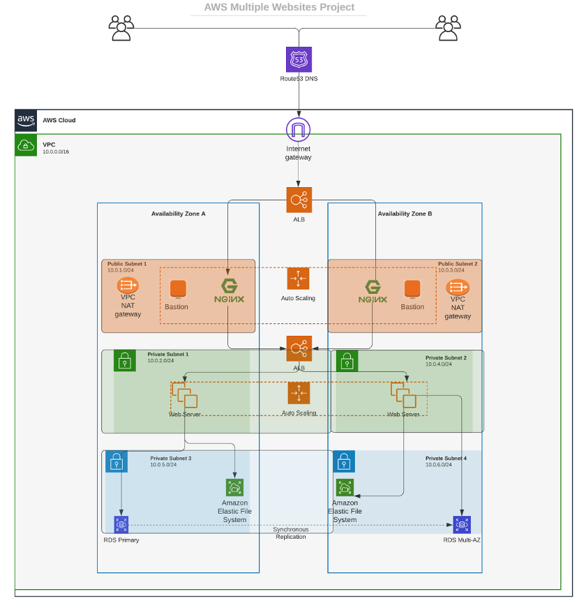
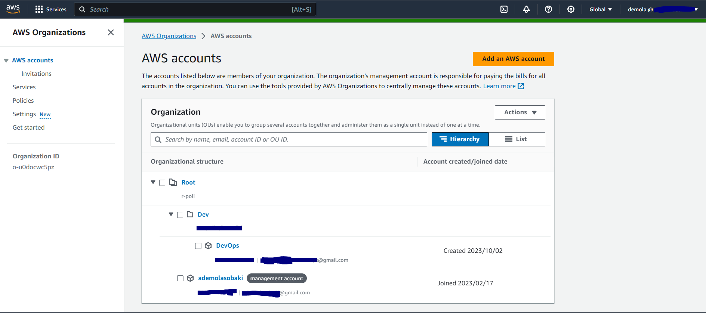

# Project 15 - AWS CLOUD SOLUTION FOR 2 COMPANY WEBSITES USING A REVERSE PROXY TECHNOLOGY

In this project, we will build a secure infrastructure inside AWS [VPC (Virtual Private Cloud)](https://en.wikipedia.org/wiki/Amazon_Virtual_Private_Cloud) network for a fictitious company (Choose an interesting name for it) that uses [WordPress CMS](https://wordpress.com/) for its main business website, and a Tooling Website (`https://github.com/<github-name>tooling`) for their DevOps team. As part of the company’s desire for improved security and performance, a decision has been made to use a [reverse proxy technology from NGINX](https://docs.nginx.com/nginx/admin-guide/web-server/reverse-proxy/) to achieve this.

*Cost, Security, and Scalability are the major requirements for this project. Hence, implemeting the architecture designed below, ensure that infrastructure for both websites, WordPress and Tooling, is resilient to Web Server’s failures, can accommodate to increased traffic and, at the same time, has reasonable cost.*

### Project Design Architecture Diagram

## Starting Off the AWS Cloud Project
There are few requirements that must be met before you begin:

1. Properly configure your AWS account and Organization Unit [Watch How To Do This Here](https://www.youtube.com/watch?v=9PQYCc_20-Q&feature=youtu.be)
    - Create an [AWS Master account](https://aws.amazon.com/free/?all-free-tier.sort-by=item.additionalFields.SortRank&all-free-tier.sort-order=asc&awsf.Free%20Tier%20Types=*all&awsf.Free%20Tier%20Categories=*all). (Also known as Root Account)
    - Within the Root account, create a sub-account and name it DevOps. (You will need another email address to complete this)
    - Within the Root account, create an AWS Organization Unit (OU). Name it Dev. (We will launch Dev resources in there)
    - Move the DevOps account into the Dev OU.
    - Login to the newly created AWS account using the new email address.

      

2. Create a free domain name for your fictitious company at Freenom domain registrar [here](https://www.freenom.com/en/index.html?lang=en).

3. Create a hosted zone in AWS, and map it to your free domain from Freenom. [Watch how to do that here](https://www.youtube.com/watch?v=IjcHp94Hq8A)

    **NOTE : As you proceed with configuration, ensure that all resources are appropriately tagged, for example:**

    - Project: Give your project a name
    - Environment: `<dev>`
    - Automated: `<No>` (If you create a resource using an automation tool, it would b`<Yes>`)