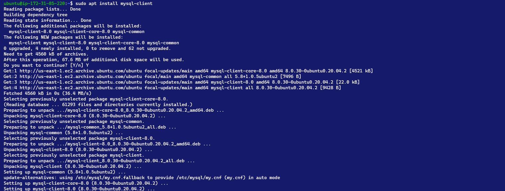
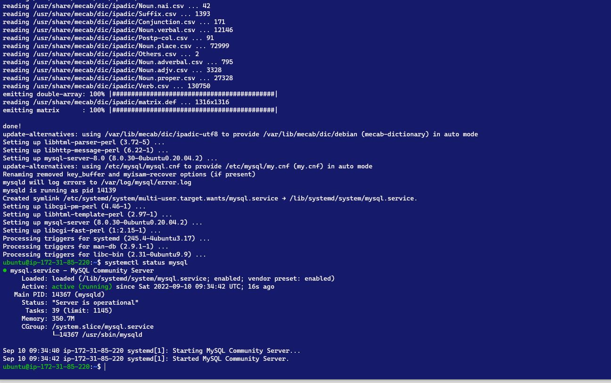
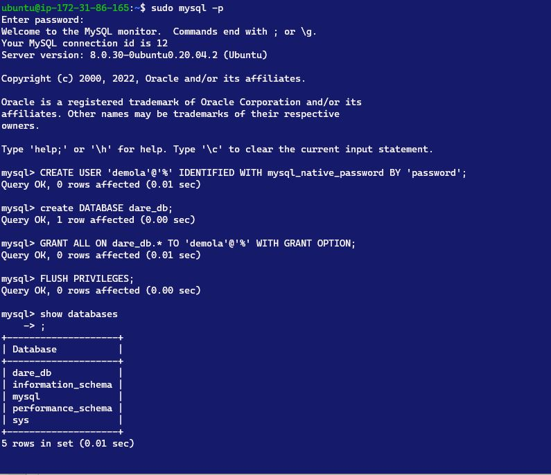
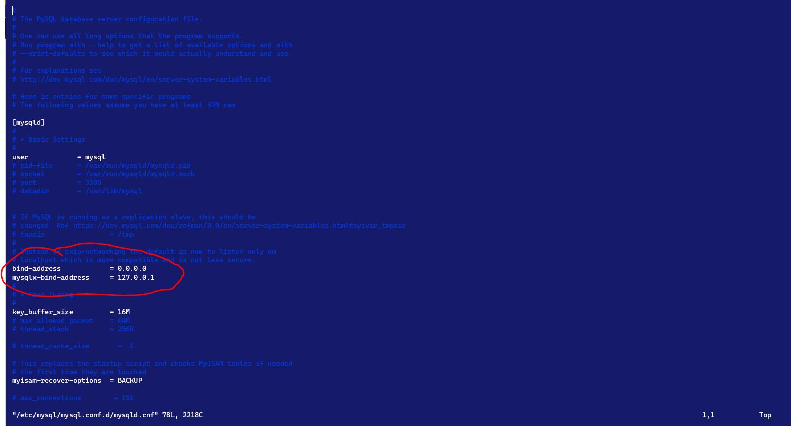
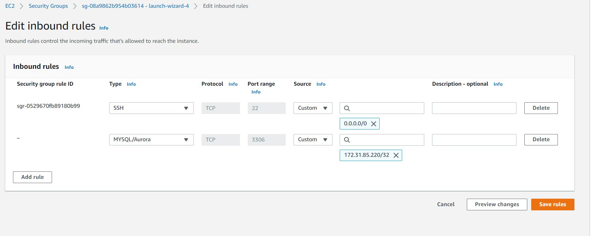
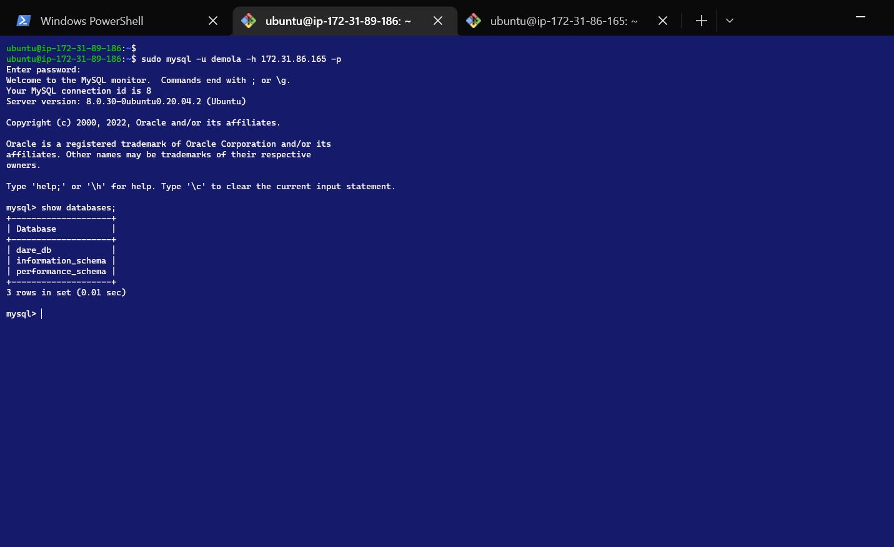

# PROJECT 5: CLIENT-SERVER IMPLEMENTATION using a MYSQL Relatonal Database Management System

## Install the `mysql-client` on the Client Machine

- `sudo apt install mysql-client`

  

---

## Install `mysql-server` on the Server machine

- `sudo apt install mysql-server`

- To check if `mysql` service is enables, run `systemctl is-enabled myqsl`

- if `mysql` service is not enabled, run `systemctl enable mysql`

- `sudo mysql`

  

  ### Create user on the Server machine

  - `CREATE USER '<username>'@'%' IDENTIFIED WITH mysql_native_password BY '<password>';`

  ### Create Database

  - `create DATABASE <database_name>;`

  ### Grant Privileges

  - `GRANT PRIVILEGE ON <database_name>.* TO '<username>'@'%' WITH GRANT OPTION;`

  ### Reloads the grant tables

  - `FLUSH PRIVILEGES`

    

    

    

  ***

## Connect to Server machine from client

- `sudo mysql -u <username> -h <server_private_ip> -p`

  
