# **PROJECT 6: Web Solution with Wordpress**

### Project 6 consists of two parts:

1. Configure storage subsystem for Web and Database servers based on Linux OS. The focus of this part allow for practical experience of working with disks, partitions and volumes in Linux.

2. Install WordPress and connect it to a remote MySQL database server. This part of the project will solidify skills of deploying Web and DB tiers of Web solution.

---

### Steps:

1.  **Prepare a Web Server**:

    1. Launch an EC2 instance that will serve as "Web Server". Create 3 volumes in the same AZ as your Web Server EC2, each of 10 GiB.

       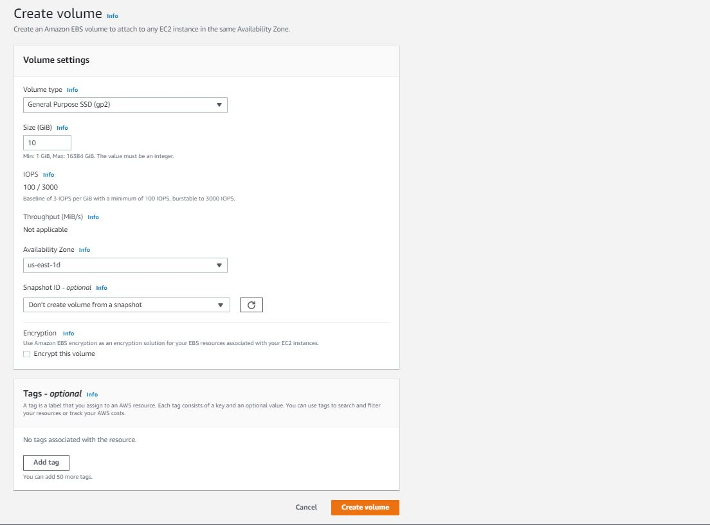

    2. Attach all three volumes one by one to your Web Server EC2 instance

       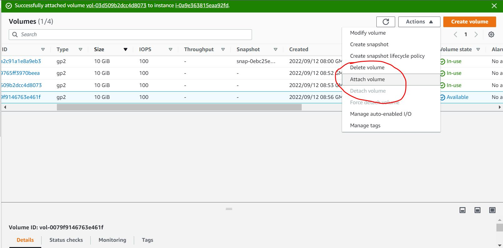

       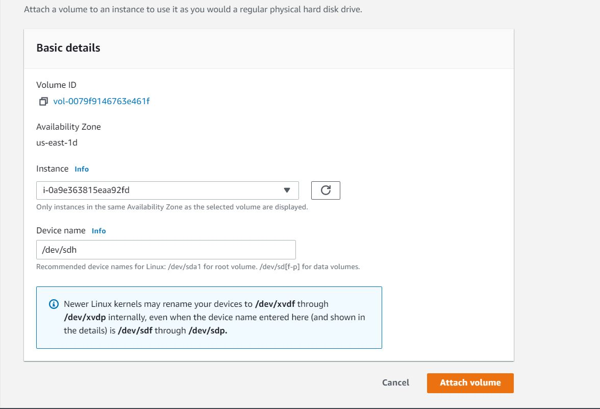

    3. Open up the Linux terminal to begin configuration

    4. Use `lsblk` command to inspect what block devices are attached to the server. Notice names of your newly created devices. All devices in Linux reside in /dev/ directory. Inspect it with ls /dev/ and make sure you see all 3 newly created block devices there – their names will likely be xvdf, xvdh, xvdg
       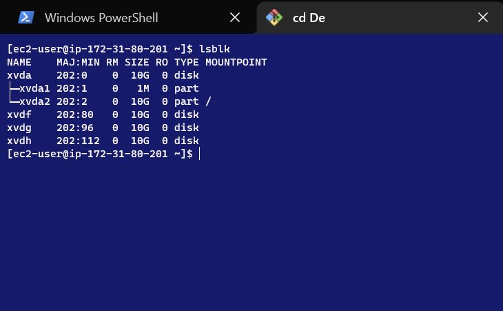

    5. Use `df -h` command to see all mounts and free space on your server
       

    6. Use `gdisk` utility to create a single partition on each of the 3 disks

       ```
       [ec2-user@ip-172-31-80-201 ~]$ sudo gdisk /dev/xvdf
        GPT fdisk (gdisk) version 1.0.3

        Partition table scan:
          MBR: protective
          BSD: not present
          APM: not present
          GPT: present

        Found valid GPT with protective MBR; using GPT.

        Command (? for help): n
        Partition number (1-128, default 1):
        First sector (34-20971486, default = 2048) or {+-}size{KMGTP}:
        Last sector (2048-20971486, default = 20971486) or {+-}size{KMGTP}:
        Current type is 'Linux filesystem'
        Hex code or GUID (L to show codes, Enter = 8300): L
        0700 Microsoft basic data  0c01 Microsoft reserved    2700 Windows RE
        3000 ONIE boot             3001 ONIE config           3900 Plan 9
        4100 PowerPC PReP boot     4200 Windows LDM data      4201 Windows LDM metadata
        4202 Windows Storage Spac  7501 IBM GPFS              7f00 ChromeOS kernel
        7f01 ChromeOS root         7f02 ChromeOS reserved     8200 Linux swap
        8300 Linux filesystem      8301 Linux reserved        8302 Linux /home
        8303 Linux x86 root (/)    8304 Linux x86-64 root (/  8305 Linux ARM64 root (/)
        8306 Linux /srv            8307 Linux ARM32 root (/)  8400 Intel Rapid Start
        8e00 Linux LVM             a000 Android bootloader    a001 Android bootloader 2
        a002 Android boot          a003 Android recovery      a004 Android misc
        a005 Android metadata      a006 Android system        a007 Android cache
        a008 Android data          a009 Android persistent    a00a Android factory
        a00b Android fastboot/ter  a00c Android OEM           a500 FreeBSD disklabel
        a501 FreeBSD boot          a502 FreeBSD swap          a503 FreeBSD UFS
        a504 FreeBSD ZFS           a505 FreeBSD Vinum/RAID    a580 Midnight BSD data
        a581 Midnight BSD boot     a582 Midnight BSD swap     a583 Midnight BSD UFS
        a584 Midnight BSD ZFS      a585 Midnight BSD Vinum    a600 OpenBSD disklabel
        a800 Apple UFS             a901 NetBSD swap           a902 NetBSD FFS
        a903 NetBSD LFS            a904 NetBSD concatenated   a905 NetBSD encrypted
        a906 NetBSD RAID           ab00 Recovery HD           af00 Apple HFS/HFS+
        af01 Apple RAID            af02 Apple RAID offline    af03 Apple label
        Press the <Enter> key to see more codes: 8e00
        af04 AppleTV recovery      af05 Apple Core Storage    af06 Apple SoftRAID Statu
        af07 Apple SoftRAID Scrat  af08 Apple SoftRAID Volum  af09 Apple SoftRAID Cache
        b300 QNX6 Power-Safe       bc00 Acronis Secure Zone   be00 Solaris boot
        bf00 Solaris root          bf01 Solaris /usr & Mac Z  bf02 Solaris swap
        bf03 Solaris backup        bf04 Solaris /var          bf05 Solaris /home
        bf06 Solaris alternate se  bf07 Solaris Reserved 1    bf08 Solaris Reserved 2
        bf09 Solaris Reserved 3    bf0a Solaris Reserved 4    bf0b Solaris Reserved 5
        c001 HP-UX data            c002 HP-UX service         e100 ONIE boot
        e101 ONIE config           ea00 Freedesktop $BOOT     eb00 Haiku BFS
        ed00 Sony system partitio  ed01 Lenovo system partit  ef00 EFI System
        ef01 MBR partition scheme  ef02 BIOS boot partition   f800 Ceph OSD
        f801 Ceph dm-crypt OSD     f802 Ceph journal          f803 Ceph dm-crypt journa
        f804 Ceph disk in creatio  f805 Ceph dm-crypt disk i  fb00 VMWare VMFS
        fb01 VMWare reserved       fc00 VMWare kcore crash p  fd00 Linux RAID
        Hex code or GUID (L to show codes, Enter = 8300): 8e00
        Changed type of partition to 'Linux LVM'

        Command (? for help): p
        Disk /dev/xvdf: 20971520 sectors, 10.0 GiB
        Sector size (logical/physical): 512/512 bytes
        Disk identifier (GUID): BB1E7042-814B-4672-8DFE-65A378984044
        Partition table holds up to 128 entries
        Main partition table begins at sector 2 and ends at sector 33
        First usable sector is 34, last usable sector is 20971486
        Partitions will be aligned on 2048-sector boundaries
        Total free space is 2014 sectors (1007.0 KiB)

        Number  Start (sector)    End (sector)  Size       Code  Name
          1            2048        20971486   10.0 GiB    8E00  Linux LVM

        Command (? for help): w

        Final checks complete. About to write GPT data. THIS WILL OVERWRITE EXISTING
        PARTITIONS!!

        Do you want to proceed? (Y/N): y
        OK; writing new GUID partition table (GPT) to /dev/xvdf.
        The operation has completed successfully.
        [ec2-user@ip-172-31-80-201 ~]$ sudo gdisk -l /dev/xvdf
        GPT fdisk (gdisk) version 1.0.3

        Partition table scan:
          MBR: protective
          BSD: not present
          APM: not present
          GPT: present

        Found valid GPT with protective MBR; using GPT.
        Disk /dev/xvdf: 20971520 sectors, 10.0 GiB
        Sector size (logical/physical): 512/512 bytes
        Disk identifier (GUID): BB1E7042-814B-4672-8DFE-65A378984044
        Partition table holds up to 128 entries
        Main partition table begins at sector 2 and ends at sector 33
        First usable sector is 34, last usable sector is 20971486
        Partitions will be aligned on 2048-sector boundaries
        Total free space is 2014 sectors (1007.0 KiB)

        Number  Start (sector)    End (sector)  Size       Code  Name
          1            2048        20971486   10.0 GiB    8E00  Linux LVM
        [ec2-user@ip-172-31-80-201 ~]$
       ```

       _the above code block created partitions for `/dev/xvdf`, do the same for the ramaining 2 volumes, in my case `/dev/xvdg` and `/dev/xvdh`_

    7. Use the `partprobe` command to inform the operating system kernel of partition table changes, by requesting that the operating system re-read the partition table.

    8. Install `lvm2` package using `sudo yum install lvm2`. Run sudo `lvmdiskscan` command to check for available partitions.

    9. Use `pvcreate` utility to mark each of 3 disks as physical volumes (PVs) to be used by LVM

       Verify that your Physical volume has been created successfully by running `sudo pvs`

       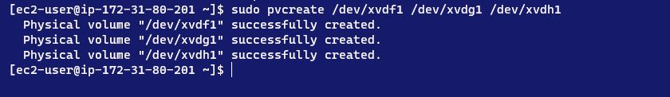

       

    10. Use `vgcreate` utility to add all 3 PVs to a volume group (VG). Named _webdata-vg_

        Verify that your VG has been created successfully by running `sudo vgs` or `sudo vgdisplay`

        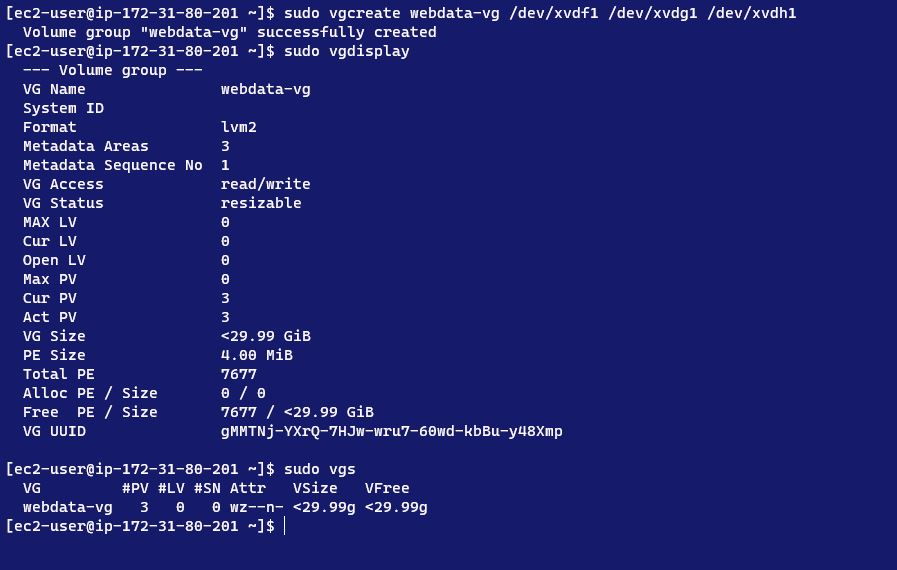

    11. Use `lvcreate` utility to create 2 logical volumes. `apps-lv` (Use half of the PV size), and `logs-lv` Use the remaining space of the VG size. NOTE: `apps-lv` will be used to store data for the Website while, `logs-lv` will be used to store data for logs.

        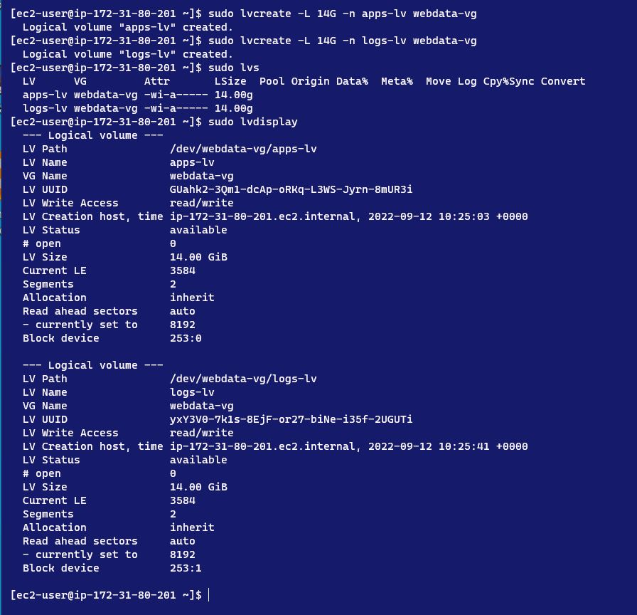

    _Use the following commands to view the complete setup of the Physical volumes, volume group and logical volumes_

          - sudo vgdisplay -v
          - sudo lsblk

    12. Use `mkfs.ext4` to format the logical volumes with **ext4** filesystem

        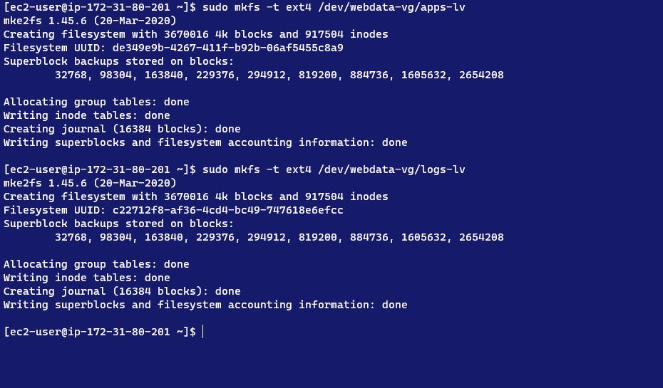

    13. Create /var/www/html directory to store website files

        `sudo mkdir -p /var/www/html`

    14. Create /home/recovery/logs to store backup of log data

        `sudo mkdir -p /home/recovery/logs`

    15. Mount the **apps-lv** logical volume in the **/var/www/html** directory

        

    16. Use `rsync` utility to backup all the files in the log directory `/var/log` into `/home/recovery/logs` (This is required before mounting the file system)

        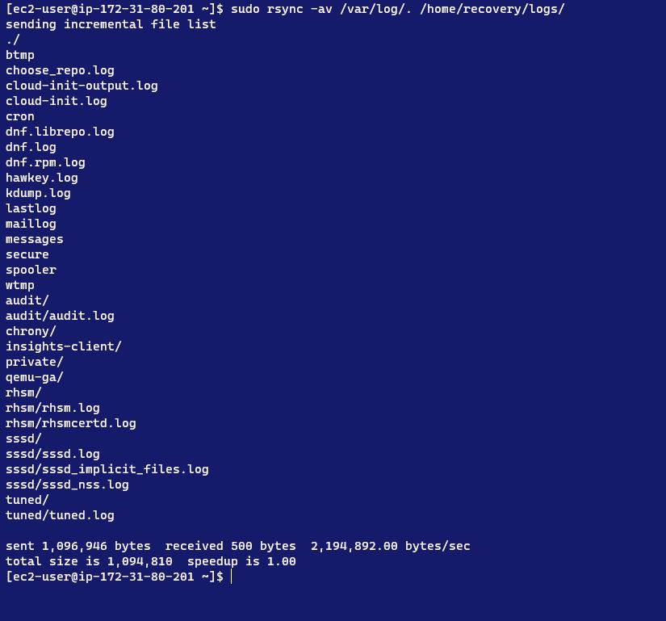

    17. Mount `/var/log` on `logs-lv` logical volume. (Note that all the existing data on `/var/log` will be deleted. That is why step 16 above is very
        important)

        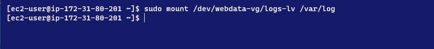

    18. Restore log files back into `/var/log` directory

        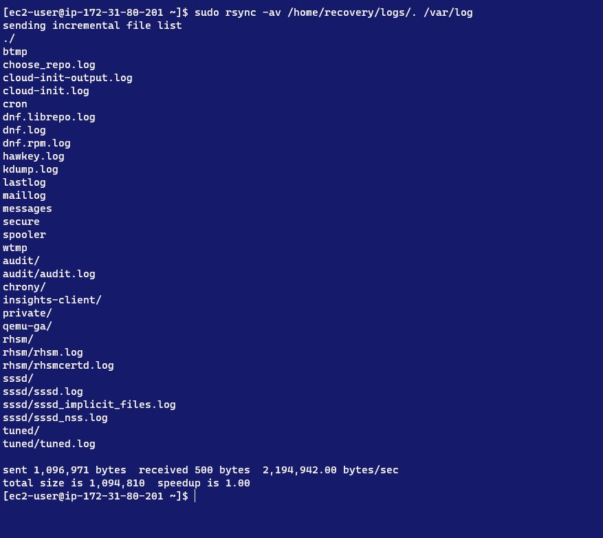

    19. Update `/etc/fstab` file so that the mount configuration will persist after restart of the server.

        **Test the configuration and reload the daemon**

            - sudo mount -a
            - sudo systemctl daemon-reload

        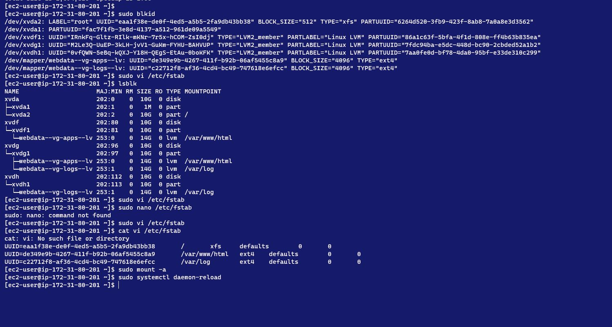

    20. Verify your setup by running `df -h`

        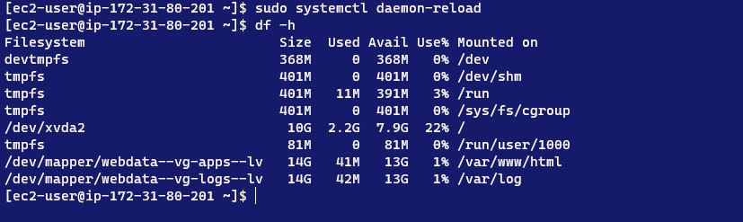

2.  **Prepare the Database Server**

        Launch a second RedHat EC2 instance that will have a role – ‘DB Server’
        Repeat the same steps as for the Web Server, but instead of apps-lv create db-lv and mount it to /db directory instead of /var/www/html/.

3.  Install WordPress on your Web Server EC2

    1.  Update the repository

        `sudo yum -y update`

    2.  Install wget, Apache and it’s dependencies

        `sudo yum -y install wget httpd php php-mysqlnd php-fpm php-json`

    3.  Start Apache

        `sudo systemctl enable httpd`
        `sudo systemctl start httpd`

    4.  Install PHP and it’s depemdencies

            sudo yum install https://dl.fedoraproject.org/pub/epel/epel-release-latest-8.noarch.rpm
            sudo yum install yum-utils http://rpms.remirepo.net/enterprise/remi-release-8.rpm
            sudo yum module list php
            sudo yum module reset php
            sudo yum module enable php:remi-7.4
            sudo yum install php php-opcache php-gd php-curl php-mysqlnd
            sudo systemctl start php-fpm
            sudo systemctl enable php-fpm
            sudo setsebool -P httpd_execmem 1

    5.  Restart Apache

        `sudo systemctl restart httpd`

    6.  Download wordpress and copy wordpress to **var/www/html**

            mkdir wordpress
            cd   wordpress
            sudo wget http://wordpress.org/latest.tar.gz
            sudo tar xzvf latest.tar.gz
            sudo rm -rf latest.tar.gz
            sudo cp wordpress/wp-config-sample.php wordpress/wp-config.php
            sudo cp -R wordpress /var/www/html/

        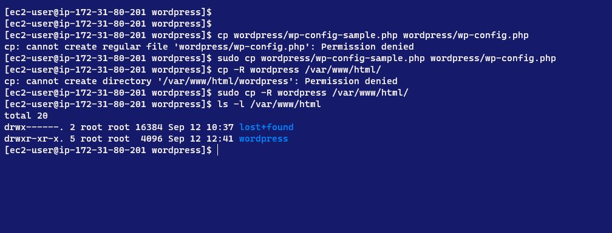

    7.  Configure SELinux Policies

            sudo chown -R apache:apache /var/www/html/wordpress
            sudo chcon -t httpd_sys_rw_content_t /var/www/html/wordpress -R
            sudo setsebool -P httpd_can_network_connect=1

        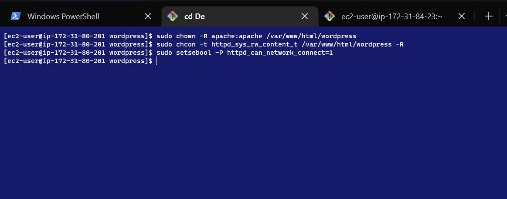

4.  **Install MySQL on your DB Server EC2**

    1.  `sudo yum update`

        `sudo yum install mysql-server`

    _Verify that the service is up and running by using `sudo systemctl status mysqld`, if it is not running, restart the service and enable it so it will be running even after reboot:_

          sudo systemctl restart mysqld
          sudo systemctl enable mysqld

    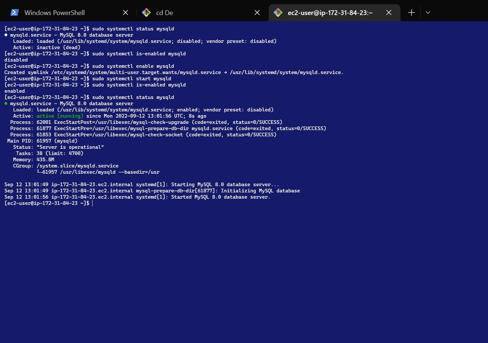

5.  **Configure DB to work with WordPress**

        sudo mysql
        CREATE DATABASE wordpress;
        CREATE USER `myuser`@`<Web-Server-Private-IP-Address>` IDENTIFIED BY 'mypass';
        GRANT ALL ON wordpress.* TO 'myuser'@'<Web-Server-Private-IP-Address>';
        FLUSH PRIVILEGES;
        SHOW DATABASES;
        exit

    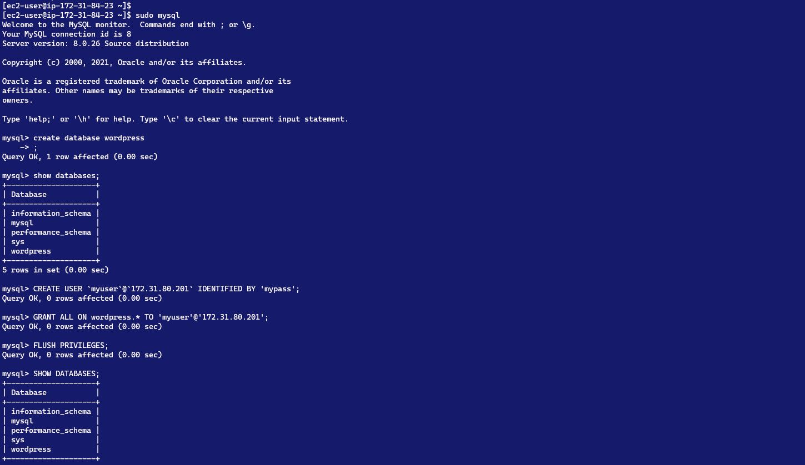

6.  **Configure WordPress to connect to remote database.**

    _NB: Do not forget to open MySQL port 3306 on DB Server EC2. For extra security, you shall allow access to the DB server ONLY from your Web Server’s IP address, so in the Inbound Rule configuration specify source as /32_

    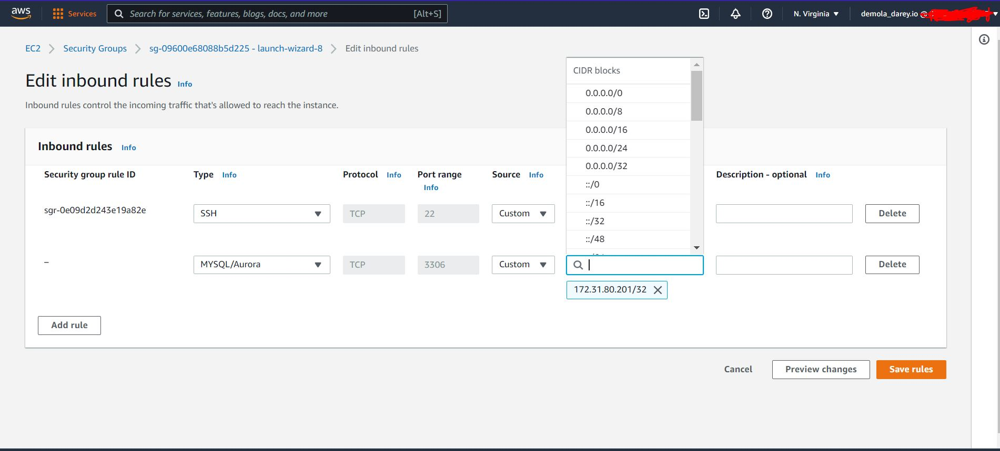

    1. Install MySQL client and test that you can connect from your Web Server to your DB server by using `mysql-client`

       ` sudo yum install mysql`

       `sudo mysql -u <myuser> -p -h <DB-Server-Private-IP-address>`

    2. Verify if you can successfully execute `SHOW DATABASES`; command and see a list of existing databases.

    3. Change permissions and configuration so Apache could use WordPress:

    4. Enable TCP port 80 in Inbound Rules configuration for your Web Server EC2 (enable from everywhere 0.0.0.0/0 or from your workstation’s IP)

    5. Try to access from your browser the link to your WordPress http://<Web-Server-Public-IP-Address>/wordpress/

    _NB: Edit the `wp-config.php` file in the `/var/www/html/wordpress` directory and add your DB_NAME, DB_USER, DB_PASSWORD and DB_HOST fields_

    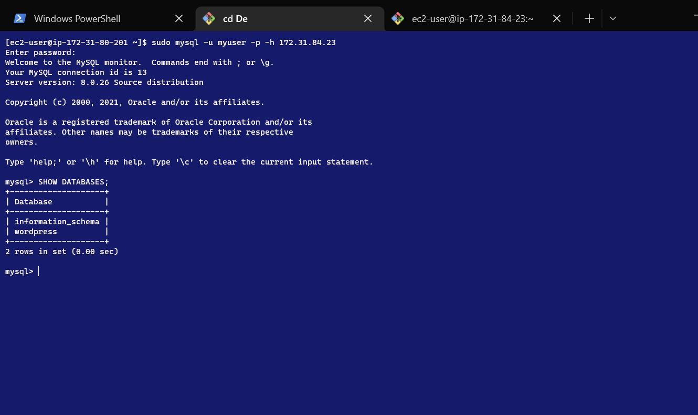

    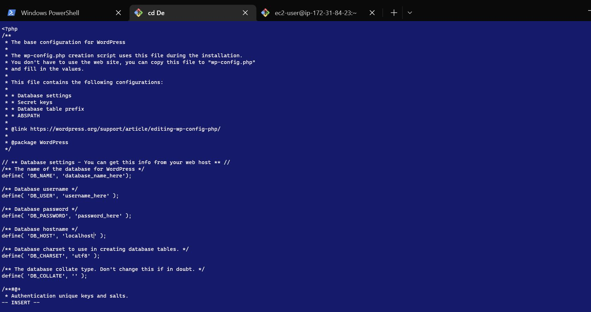

    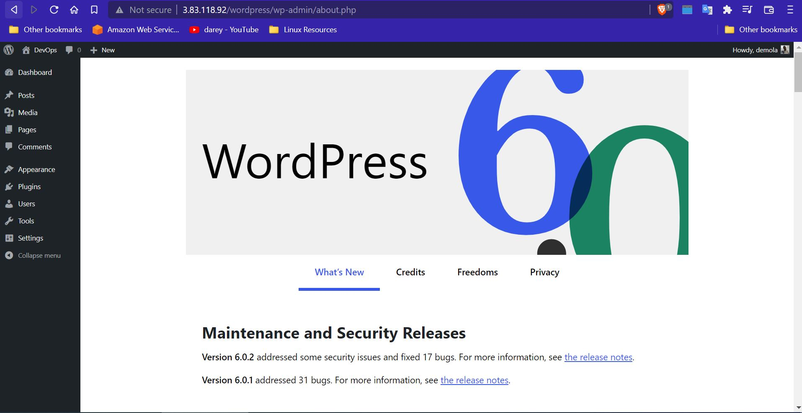

    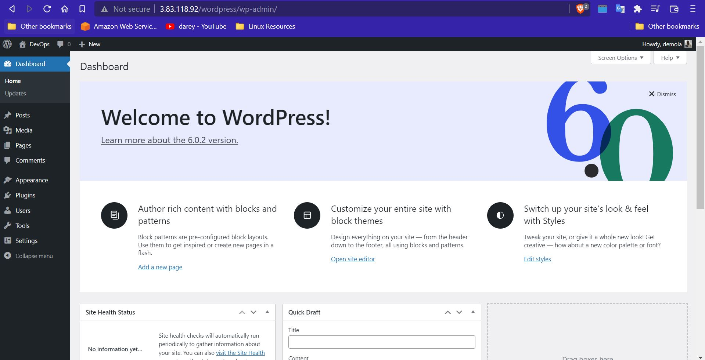
