# **PROJECT 7: DEVOPS TOOLING WEBSITE SOLUTION**

**As a member of a DevOps team, you will implement a tooling website solution which makes access to DevOps tools within the corporate infrastructure easily accessible.**

**In this project you will implement a solution that consists of following components:**

1. Infrastructure: AWS
2. Webserver Linux: Red Hat Enterprise Linux 8
3. Database Server: Ubuntu 20.04 + MySQL
4. Storage Server: Red Hat Enterprise Linux 8 + NFS Server
5. Programming Language: PHP
6. Code Repository: GitHub

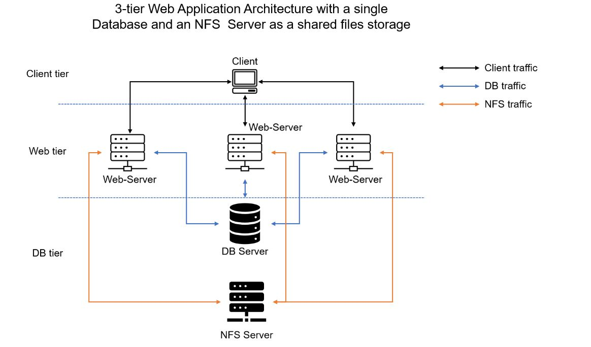
**_Project 7 Architecture Diagram_**

---

## STEP 1 – PREPARE NFS SERVER

#### 1. Spin up a new EC2 instance with RHEL Linux 8 Operating System

#### 2. Based on your LVM experience from [Project 6](https://github.com/demola07/darey.io_projects/blob/main/project6.md), Configure LVM on the Server.

    - Instead of formating the disks as `ext4` you will have to format them as `xfs`

    - Ensure there are 3 Logical Volumes. `lv-opt`, `lv-apps` and `lv-logs`

    - Create mount points on /mnt directory for the logical volumes as follow:

          Mount lv-apps on /mnt/apps – To be used by webservers
          Mount lv-logs on /mnt/logs – To be used by webserver logs
          Mount lv-opt on /mnt/opt – To be used by Jenkins server in Project 8

#### 3. Install NFS server, configure it to start on reboot and make sure it is up and running

        sudo yum -y update
        sudo yum install nfs-utils -y
        sudo systemctl start nfs-server.service
        sudo systemctl enable nfs-server.service
        sudo systemctl status nfs-server.service

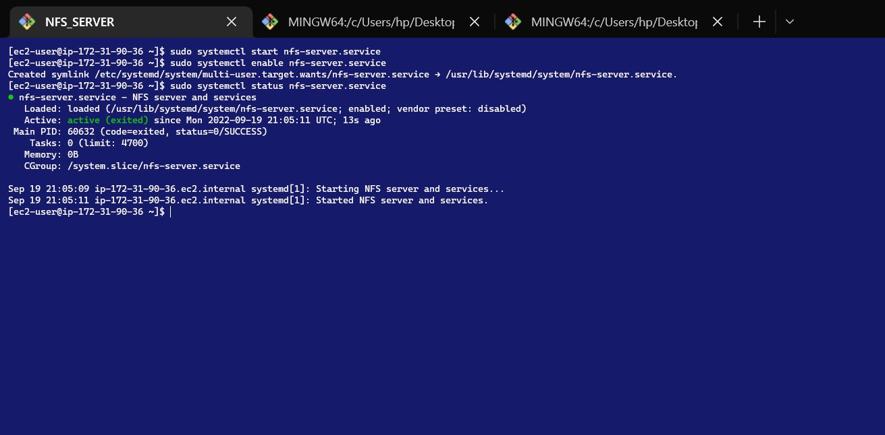

#### 4. Make sure we set up permission that will allow our Web servers to read, write and execute files on NFS:

        sudo chown -R nobody: /mnt/apps
        sudo chown -R nobody: /mnt/logs
        sudo chown -R nobody: /mnt/opt

        sudo chmod -R 777 /mnt/apps
        sudo chmod -R 777 /mnt/logs
        sudo chmod -R 777 /mnt/opt

        sudo systemctl restart nfs-server.service

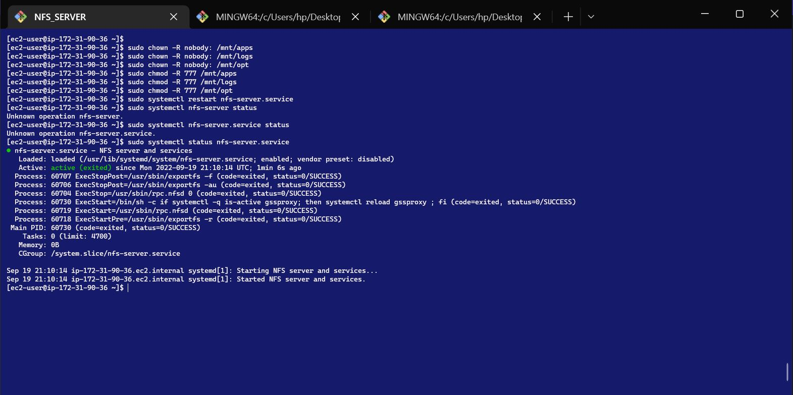

    Configure access to NFS for clients within the same subnet (example of Subnet CIDR – 172.31.32.0/20 ):

        sudo vi /etc/exports

        /mnt/apps <Subnet-CIDR>(rw,sync,no_all_squash,no_root_squash)
        /mnt/logs <Subnet-CIDR>(rw,sync,no_all_squash,no_root_squash)
        /mnt/opt <Subnet-CIDR>(rw,sync,no_all_squash,no_root_squash)

        Esc + :wq!

        sudo exportfs -arv

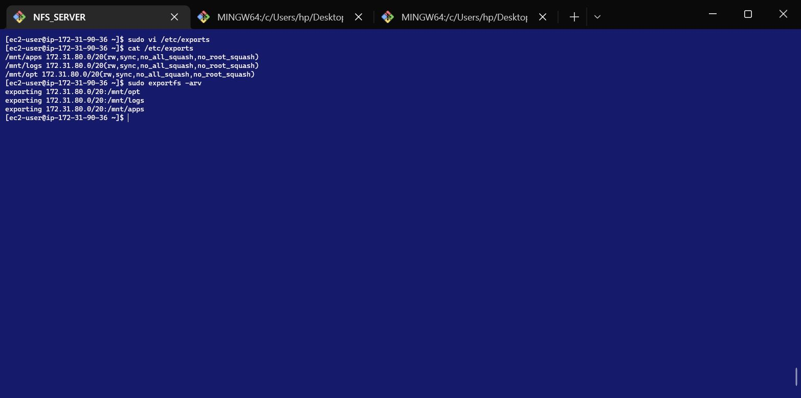

#### 5. Check which port is used by NFS and open it using Security Groups (add new Inbound Rule)

    `rpcinfo -p | grep nfs`

    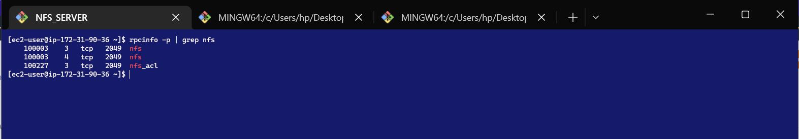

    _Important note: In order for NFS server to be accessible from your client, you must also open following ports: TCP 111, UDP 111, UDP 2049_

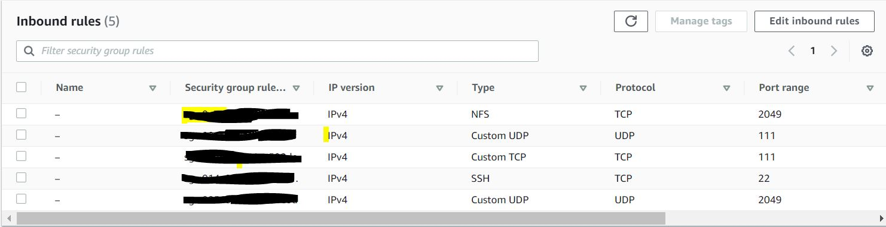

---

## STEP 2 — CONFIGURE THE DATABASE SERVER

    1. Install MySQL server
    2. Create a database and name it tooling
    3. Create a database user and name it webaccess
    4. Grant permission to webaccess user on tooling database to do anything only from the webservers subnet cidr

**_To configure the database server, refer to [Project 5](https://github.com/demola07/darey.io_projects/blob/main/project5.md)_**

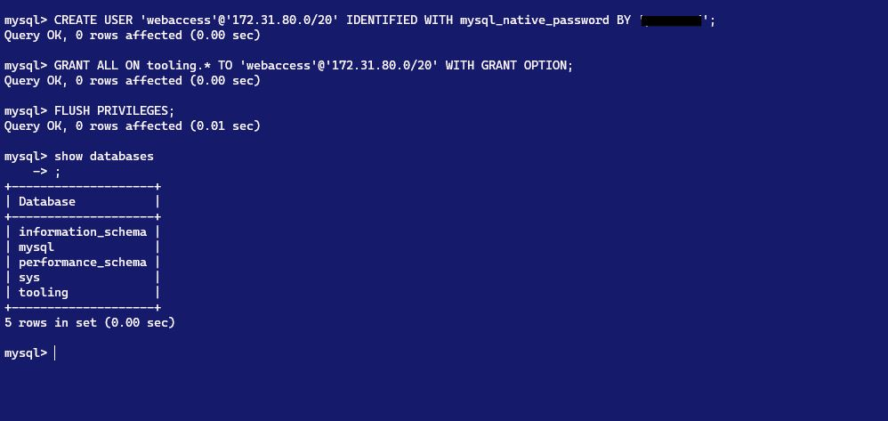

---

## Step 3 — Prepare the Web Servers

We need to make sure that our Web Servers can serve the same content from shared storage solutions, in our case – NFS Server and MySQL database.
You already know that one DB can be accessed for reads and writes by multiple clients. For storing shared files that our Web Servers will use – we will utilize NFS and mount previously created Logical Volume lv-apps to the folder where Apache stores files to be served to the users (/var/www).

This approach will make our Web Servers stateless, which means we will be able to add new ones or remove them whenever we need, and the integrity of the data (in the database and on NFS) will be preserved.

During the next steps we will do following:

- Configure NFS client (this step must be done on all three servers)
- Deploy a Tooling application to our Web Servers into a shared NFS folder
- Configure the Web Servers to work with a single MySQL database

#### 1. Launch a new EC2 instance with RHEL 8 Operating System

#### 2. Install NFS client

      sudo yum install nfs-utils nfs4-acl-tools -y

#### 3. Mount `/var/www/` and target the NFS server’s export for apps

      sudo mkdir /var/www
      sudo mount -t nfs -o rw,nosuid <NFS-Server-Private-IP-Address>:/mnt/apps /var/www

#### 4. Verify that NFS was mounted successfully by running `df -h`. Make sure that the changes will persist on Web Server after reboot:

        sudo vi /etc/fstab

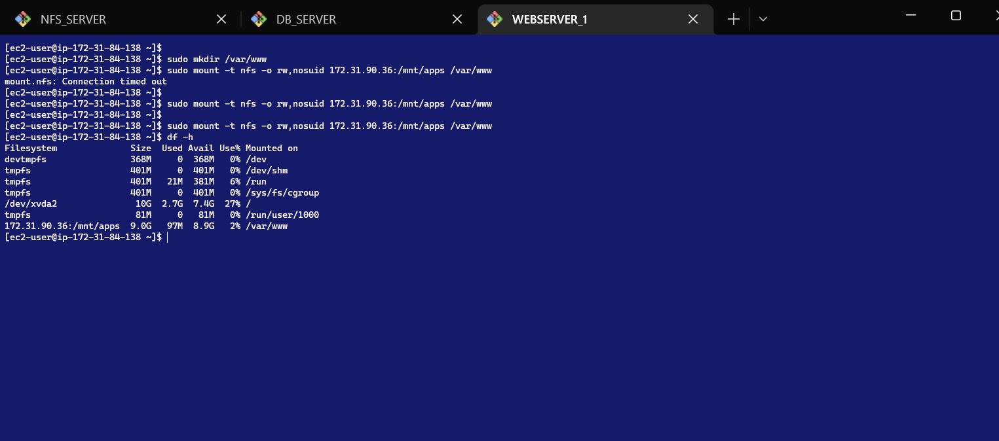

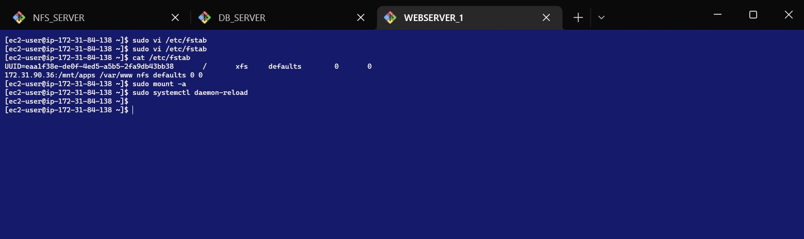

#### 5. Install [Remi’s repository](http://www.servermom.org/how-to-enable-remi-repo-on-centos-7-6-and-5/2790/), Apache and PHP

      sudo yum install httpd -y
      sudo dnf install https://dl.fedoraproject.org/pub/epel/epel-release-latest-8.noarch.rpm
      sudo dnf install dnf-utils http://rpms.remirepo.net/enterprise/remi-release-8.rpm
      sudo dnf module reset php
      sudo dnf module enable php:remi-7.4
      sudo dnf install php php-opcache php-gd php-curl php-mysqlnd
      sudo systemctl start php-fpm
      sudo systemctl enable php-fpm
      setsebool -P httpd_execmem 1

**_Repeat steps 1-5 for another 2 Web Servers._**

#### 6. Verify that Apache files and directories are available on the Web Server in `/var/www` and also on the NFS server in `/mnt/apps`. If you see the same files – it means `NFS` is mounted correctly. You can try to create a new file `touch test.txt` from one server and check if the same file is accessible from other Web Servers.

#### 7. Locate the log folder for Apache on the Web Server and mount it to NFS server’s export for logs. Repeat step №4 to make sure the mount point will persist after reboot.

**_The apache log file often contain details of what went wrong and how to fix it. Default error log file location is as follows:_**

          RHEL / Red Hat / CentOS / Fedora Linux Apache error file location – /var/log/httpd/error_log
          Debian / Ubuntu Linux Apache error log file location – /var/log/apache2/error.log
          FreeBSD Apache error log file location – /var/log/httpd-error.log

`sudo mount -t nfs -o rw,nosuid <NFS-Server-Private-IP-Address>:/mnt/logs /var/log/httpd`

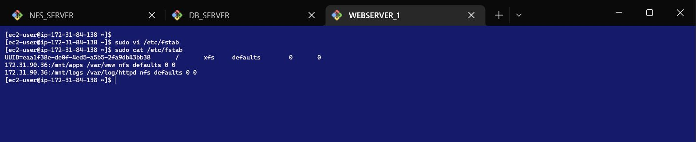

#### 7. Fork the tooling source code from [Darey.io Github Account](https://github.com/darey-io/tooling) to your Github account.

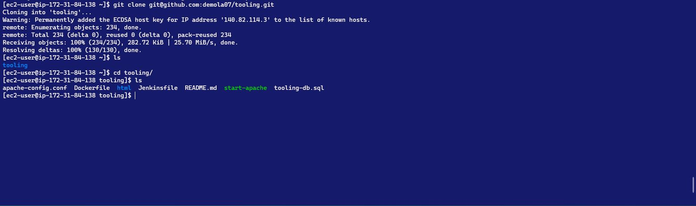

#### 8. Deploy the tooling website’s code to the Webserver. Ensure that the html folder from the repository is deployed to `/var/www/html`

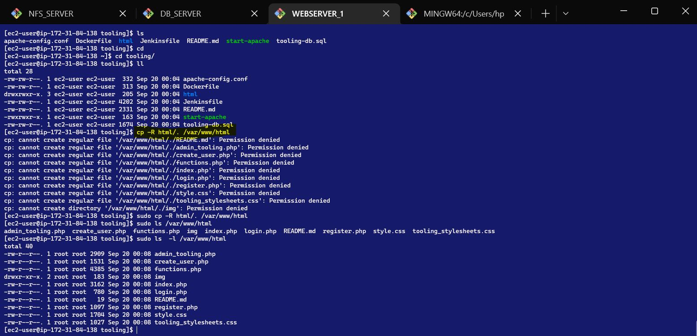

**_Note 1: Do not forget to open TCP port 80 on the Web Server._**

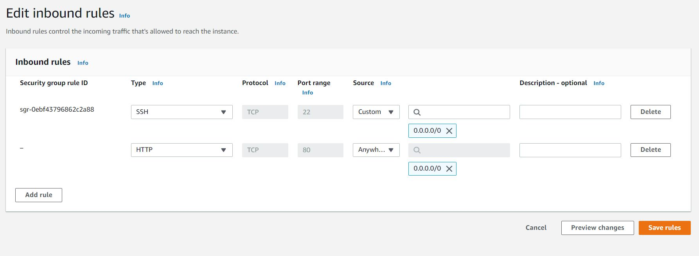

**_Note 2: If you encounter 403 Error – check permissions to your `/var/www/html` folder and also disable SELinux `sudo setenforce 0`_**

\*_To make this change permanent – open following config file `sudo vi /etc/sysconfig/selinux` and set `SELINUX=disabled`then restart `httpd`._

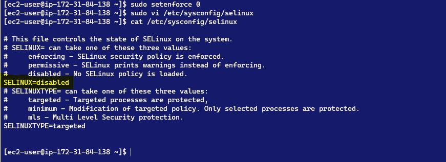

#### 8. Update the website’s configuration to connect to the database (in `/var/www/html/functions.php` file). Apply tooling-db.sql script to your database using this command:

`mysql -h <databse-private-ip> -u <db-username> -p <db-pasword> < tooling-db.sql` - run command inside `tooling` directory

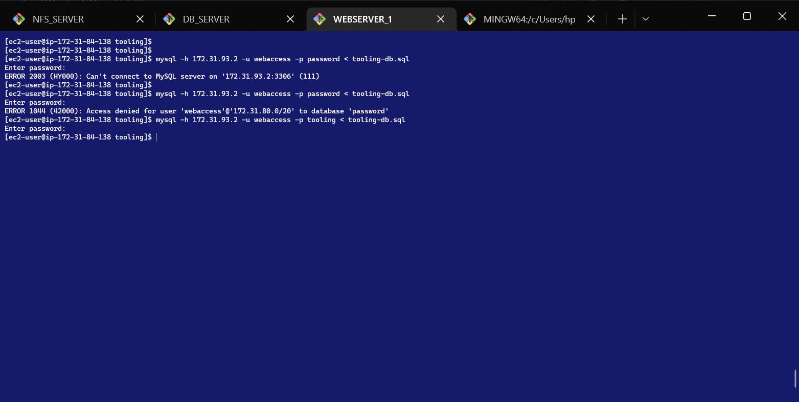

_*NOTE: If you run into an error with the above step;*_

- You may need to install the mysql client `sudo yum install mysql` and also open the MYSQL port on the database server

  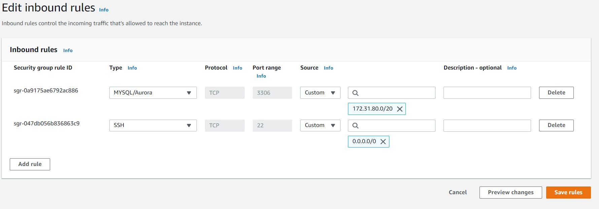

- You may also need to change the bind address in the `/etc/mysql/mysql.conf.d/mysqld.cnf` file.
  Restart mysql service after editing the bind-address `sudo systemctl restart mysql` and ensure mysql is running `sudo systemctl status mysql`

  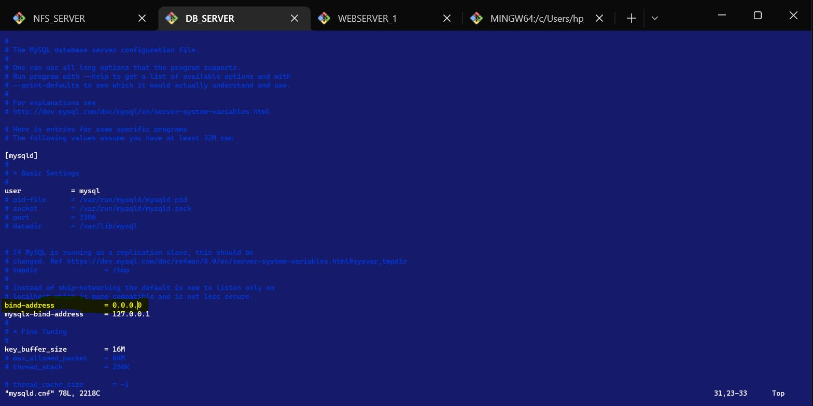

  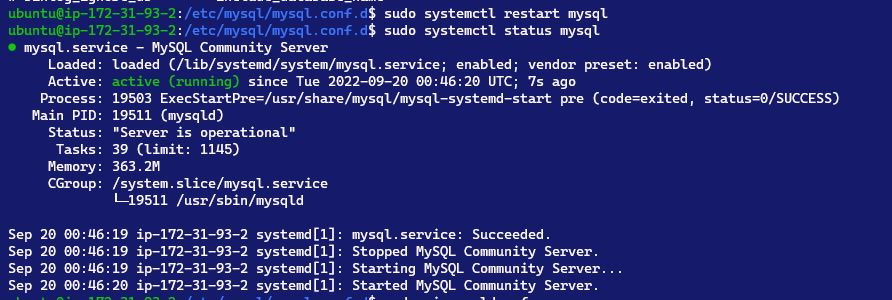

#### 9. Create in MySQL a new admin user with username: myuser and password: password:

      INSERT INTO ‘users’ (‘id’, ‘username’, ‘password’, ’email’, ‘user_type’, ‘status’) VALUES
      -> (1, ‘myuser’, ‘5f4dcc3b5aa765d61d8327deb882cf99’, ‘user@mail.com’, ‘admin’, ‘1’);

#### 10. Open the website in your browser `http://<Web-Server-Public-IP-Address-or-Public-DNS-Name>/index.php` and make sure you can login

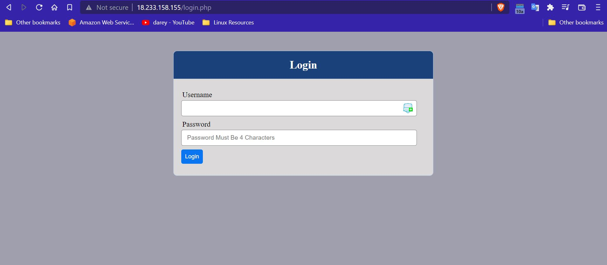

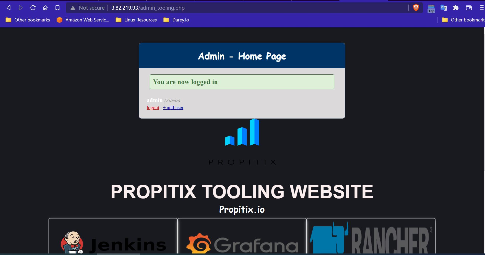

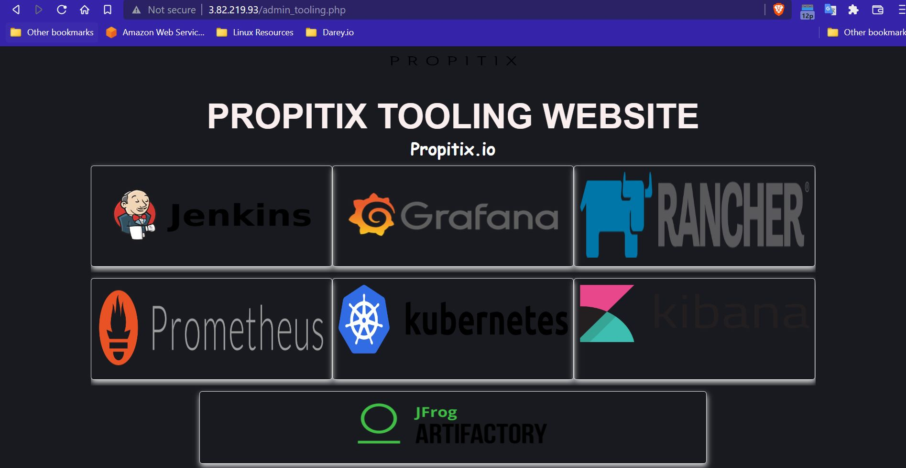
