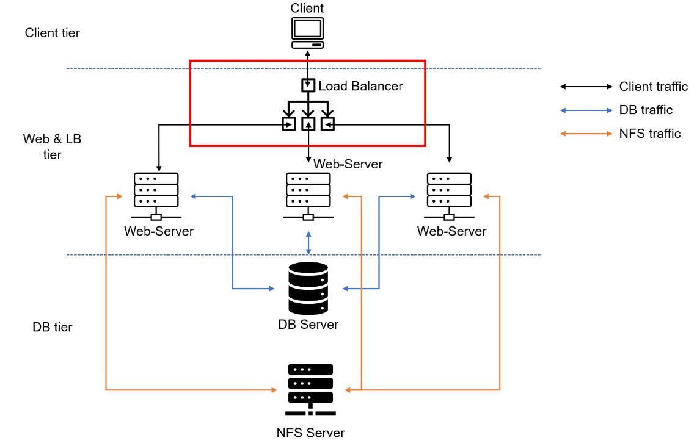

# **PROJECT 8: LOAD BALANCER SOLUTION WITH APACHE**

## Task

**Deploy and configure an Apache Load Balancer for Tooling Website solution on a separate Ubuntu EC2 intance. Make sure that users can be served by Web servers through the Load Balancer.**

**Prerequisites**

Make sure that you have following servers installed and configured within [Project-7](https://github.com/demola07/darey.io_projects/blob/main/project7.md):

1. Two RHEL8 Web Servers
2. One MySQL DB Server (based on Ubuntu 20.04)
3. One RHEL8 NFS server

**_Project 8 Architecture Diagram_**

---

### CONFIGURE APACHE AS A LOAD BALANCER

#### 1. Create an Ubuntu Server 20.04 EC2 instance and name it Project-8-apache-lb, so your EC2 list will look like this:

#### 2. Open TCP port 80 on Project-8-apache-lb by creating an Inbound Rule in Security Group.

#### 3. Install Apache Load Balancer on Project-8-apache-lb server and configure it to point traffic coming to LB to both Web Servers:

    #Install apache2
    sudo apt update
    sudo apt install apache2 -y
    sudo apt-get install libxml2-dev

    #Enable following modules:
    sudo a2enmod rewrite
    sudo a2enmod proxy
    sudo a2enmod proxy_balancer
    sudo a2enmod proxy_http
    sudo a2enmod headers
    sudo a2enmod lbmethod_bytraffic

    #Restart apache2 service
    sudo systemctl restart apache2

    #Make sure apache2 is up and running
    sudo systemctl restart apache2

**Configure load balancing**

`sudo vi /etc/apache2/sites-available/000-default.conf`

    #Add this configuration into this section <VirtualHost *:80>  </VirtualHost>

    <Proxy "balancer://mycluster">
                  BalancerMember http://<WebServer1-Private-IP-Address>:80 loadfactor=5 timeout=1
                  BalancerMember http://<WebServer2-Private-IP-Address>:80 loadfactor=5 timeout=1
                  ProxySet lbmethod=bytraffic
                  # ProxySet lbmethod=byrequests
            </Proxy>

            ProxyPreserveHost On
            ProxyPass / balancer://mycluster/
            ProxyPassReverse / balancer://mycluster/

    #Restart apache server

    sudo systemctl restart apache2

#### 4. Verify that our configuration works – try to access your LB’s public IP address or Public DNS name from your browser:

`http://<Load-Balancer-Public-IP-Address-or-Public-DNS-Name>/index.php`

**_Note: If in the [Project-7](https://github.com/demola07/darey.io_projects/blob/main/project7.md) you mounted /var/log/httpd/ from your Web Servers to the NFS server – unmount them and make sure that each Web Server has its own log directory._**

Open two ssh/Putty consoles for both Web Servers and run following command:

    sudo tail -f /var/log/httpd/access_log

---

### Optional Step – Configure Local DNS Names Resolution

Sometimes it is tedious to remember and switch between IP addresses, especially if you have a lot of servers under your management.
What we can do, is to configure local domain name resolution. The easiest way is to use /etc/hosts file, although this approach is not very scalable, but it is very easy to configure and shows the concept well. So let us configure IP address to domain name mapping for our LB.

    #Open this file on your LB server

    sudo vi /etc/hosts

    #Add 2 records into this file with Local IP address and arbitrary name for both of your Web Servers

    <WebServer1-Private-IP-Address> Web1
    <WebServer2-Private-IP-Address> Web2

Now you can update your LB config file with those names instead of IP addresses.

    BalancerMember http://Web1:80 loadfactor=5 timeout=1
    BalancerMember http://Web2:80 loadfactor=5 timeout=1

You can try to curl your Web Servers from LB locally curl http://Web1 or curl http://Web2 – it shall work.

**_Remember, this is only internal configuration and it is also local to your LB server, these names will neither be ‘resolvable’ from other servers internally nor from the Internet_**

**_Project 8 Complete Project Architecture Diagram_**
